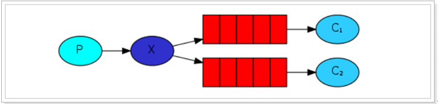
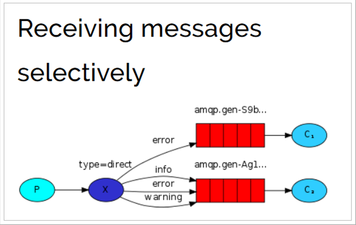

# 1. 消息中间件概述

## 1.1.为什么学习消息队列

电子商务应用中，经常需要对庞大的海量数据进行监控，随着网络技术和软件开发技术的不断提高，在实战开发中MQ的使用与日俱增，特别是RabbitMQ在分布式系统中存储转发消息，可以保证数据不丢失，也能保证高可用性，即集群部署的时候部分机器宕机可以继续运行。在大型电子商务类网站，如京东、淘宝、去哪儿等网站有着深入的应用 。

队列的主要作用是**消除高并发访问高峰，加快网站的响应速度**。

在不使用消息队列的情况下，用户的请求数据直接写入数据库，在高并发的情况下，会对数据库造成巨大的压力，同时也使得系统响应延迟加剧。

## 1.2.什么是消息中间件

MQ全称为**Message Queue**， 消息队列(MQ)是一种应用程序对应用程序的通信方法。

介绍：消息队列就是基础数据结构中的“先进先出”的一种数据机构。想一下，生活中买东西，需要排队，先排的人先买消费，就是典型的“先进先出”。


**消息传递：**指的是程序之间通过消息发送数据进行通信，而不是通过直接调用彼此来通信，直接调用通常是用于诸如远程过程调用的技术。

**排队：**指的是应用程序通过队列来通信。

**业务场景说明：**

消息队列在大型电子商务类网站，如京东、淘宝、去哪儿等网站有着深入的应用，为什么会产生消息队列？有几个原因：

不同进程（process）之间传递消息时，两个进程之间**耦合**程度过高，改动一个进程，引发必须修改另一个进程，为了**隔离**这两个进程，在两进程间抽离出一层（一个模块），所有两进程之间传递的消息，都必须通过消息队列来传递，单独修改某一个进程，不会影响另一个；

不同进程（process）之间传递消息时，为了实现标准化，将消息的格式规范化了，并且，某一个进程接受的**消息太多**，一下子无法处理完，并且也有先后顺序，必须对收到的消息**进行排队**，因此诞生了事实上的消息队列；

在项目中，可将一些无需即时返回且耗时的操作提取出来，进行**异步处理**，而这种异步处理的方式大大的节省了服务器的请求响应时间，从而**提高**了**系统**的**吞吐量**。

## 1.3.消息队列应用场景

首先我们先说一下消息中间件的主要的作用：

**异步处理**

**解耦服务**

**流量削峰**

上面的三点是我们使用消息中间件最主要的目的.

### 1.3.1.应用解耦

**传统模式：**

**传统模式的缺点：**

- 系统间耦合性太强，如上图所示，系统A在代码中直接调用系统B和系统C的代码，如果将来D系统接入，系统A还需要修改代码，过于麻烦！

**中间件模式：**

**中间件模式的的优点：**

- 将消息写入消息队列，需要消息的系统自己从消息队列中订阅，从而系统A不需要做任何修改。

### 1.3.2.异步处理

场景说明：用户注册后，需要发注册邮件和注册短信，传统的做法有两种

l 串行的方式

l 并行的方式

**串行方式：**

将注册信息写入数据库后，发送注册邮件，再发送注册短信，以上三个任务全部完成后才返回给客户端。 这有一个问题是，邮件，短信并不是必须的，它只是一个通知，而这种做法让客户端等待没有必要等待的东西。


**并行方式：**

将注册信息写入数据库后，发送邮件的同时，发送短信，以上三个任务完成后，返回给客户端，并行的方式能提高处理的时间。


假设三个业务节点分别使用50ms，串行方式使用时间150ms，并行使用时间100ms。虽然并行已经提高了处理时间，但是，前面说过，邮件和短信对我正常的使用网站没有任何影响，客户端没有必要等着其发送完成才显示注册成功，应该是写入数据库后就返回.

**消息队列**
引入消息队列后，把发送邮件，短信不是必须的业务逻辑异步处理


由此可以看出，引入消息队列后，用户的响应时间就等于写入数据库的时间+写入消息队列的时间(可以忽略不计)，

引入消息队列后处理后，响应时间是串行的3分之1，是并行的2分之1。

**传统模式的缺点：**

- 一些非必要的业务逻辑以同步的方式运行，太耗费时间。

**中间件模式的的优点：**

- 将消息写入消息队列，非必要的业务逻辑以异步的方式运行，加快响应速度

### 1.3.3.流量削峰

流量削峰一般在秒杀活动中应用广泛

**场景：** 秒杀活动，一般会因为流量过大，导致应用挂掉，为了解决这个问题，一般在应用前端加入消息队列。

**传统模式**

如订单系统，在下单的时候就会往数据库写数据。但是数据库只能支撑每秒1000左右的并发写入，并发量再高就容易宕机。低峰期的时候并发也就100多个，但是在高峰期时候，并发量会突然激增到5000以上，这个时候数据库肯定卡死了。


**传统模式的缺点：**

- 并发量大的时候，所有的请求直接怼到数据库，造成数据库连接异常

**中间件模式：**

消息被MQ保存起来了，然后系统就可以按照自己的消费能力来消费，比如每秒1000个数据，这样慢慢写入数据库，这样就不会卡死数据库了。


**中间件模式的的优点：**

系统A慢慢的按照数据库能处理的并发量，从消息队列中慢慢拉取消息。在生产中，这个短暂的高峰期积压是允许的。

流量削峰也叫做削峰填谷

使用了MQ之后，限制消费消息的速度为1000，但是这样一来，高峰期产生的数据势必会被积压在MQ中，高峰就被“削”掉了。但是因为消息积压，在高峰期过后的一段时间内，消费消息的速度还是会维持在1000QPS，直到消费完积压的消息，这就叫做“填谷”

### 1.3.4.什么是QPS，PV

QPS即每秒查询率，是对一个特定的查询服务器在规定时间内所处理流量多少的衡量标准。

每秒查询率

因特网上，经常用每秒查询率来衡量域名系统服务器的机器的性能，即为QPS。

或者理解：每秒的响应请求数，也即是最大吞吐能力。

计算关系：

QPS = 并发量 / 平均响应时间

并发量 = QPS * 平均响应时间

原理：每天80%的访问集中在20%的时间里，这20%时间叫做峰值时间。

公式：( 总PV数 * 80% ) / ( 每天秒数 * 20% ) = 峰值时间每秒请求数(QPS) 。

机器：峰值时间每秒QPS / 单台机器的QPS = 需要的机器 。

### 1.3.5.什么是PV ， UV ， PR

① 什么是pv　　

**PV(page view)**，即页面浏览量，或点击量；通常是衡量一个网络新闻频道或网站甚至一条网络新闻的主要指标。

对pv的解释是，一个访问者在24小时(0点到24点)内到底看了你网站几个页面。这里需要强调：同一个人浏览你网站同一个页面，不重复计算pv量，点100次也算1次。说白了，pv就是一个访问者打开了你的几个页面。

PV之于网站，就像收视率之于电视，从某种程度上已成为投资者衡量商业网站表现的最重要尺度。

pv的计算：当一个访问者访问的时候，记录他所访问的页面和对应的IP，然后确定这个IP今天访问了这个页面没有。如果你的网站到了23点，单纯IP有60万条的话，每个访问者平均访问了3个页面，那么pv表的记录就要有180万条。

② 什么是uv
**uv(unique visitor)**，指访问某个站点或点击某条新闻的不同IP地址的人数。

在同一天内，uv只记录第一次进入网站的具有独立IP的访问者，在同一天内再次访问该网站则不计数。独立IP访问者提供了一定时间内不同观众数量的统计指标，而没有反应出网站的全面活动。

③ 什么是ＰＲ值
 　PR值，即**PageRank**，网页的级别技术，用来标识网页的等级/重要性。级别从1到10级，10级为满分。PR值越高说明该网页越受欢迎（越重要）。

例如：一个PR值为1的网站表明这个网站不太具有流行度，而PR值为7到10则表明这个网站非常受欢迎（或者说极其重要）。

## 1.4. AMQP 和 JMS

MQ是消息通信的模型；实现MQ的大致有两种主流方式：AMQP、JMS。

### 1.4.1. AMQP

AMQP是一种**高级消息队列协议（****Advanced Message Queuing Protocol****）**，更准确的说是一种binary wire-level protocol（**链接协议**）。这是其和JMS的本质差别，AMQP不从API层进行限定，而是直接定义网络交换的数据格式。

### 1.4.2. JMS

JMS即Java**消息服务**（****JavaMessage Service****）**应用程序接口，是一个Java平台中关于面向消息中间件（MOM）的API，用于在两个应用程序之间，或分布式系统中发送消息，进行异步通信。

### 1.4.3. AMQP 与 JMS 区别

- JMS是定义了统一的接口，来对消息操作进行统一；AMQP是通过规定协议来统一数据交互的格式
- JMS限定了必须使用Java语言；AMQP只是协议，不规定实现方式，因此是跨语言的。
- JMS规定了两种消息模式；而AMQP的消息模式更加丰富

## 1.5. 消息队列产品

市场上常见的消息队列有如下：

- ActiveMQ：基于JMS
- ZeroMQ：基于C语言开发
- Rabbitmq:基于AMQP协议，erlang语言开发，稳定性好
- RocketMQ：基于JMS，阿里巴巴产品
- Kafka：类似MQ的产品；分布式消息系统，高吞吐量


## 1.6. RabbitMQ

RabbitMQ是由erlang语言开发，基于AMQP（Advanced Message Queue 高级消息队列协议）协议实现的消息队列，它是一种应用程序之间的通信方法，消息队列在分布式系统开发中应用非常广泛。

RabbitMQ官方地址：http://www.rabbitmq.com/

RabbitMQ提供了**6种模式**：简单模式，work模式 ，Publish/Subscribe发布与订阅模式，Routing路由模式，Topics主题模式，RPC远程调用模式（远程调用，不太算MQ；暂不作介绍）；

官网对应模式介绍：https://www.rabbitmq.com/getstarted.html


### 1.6.1 **RabbitMQ**简介

AMQP，即 Advanced
Message Queuing Protocol（高级消息队列协议），是一个网络协议，是应用层协议的一个开放标准，为面向消息的中间件设计。基于此协议的客户端与消息中间件可传递消息，并不受客户端/中间件不同产品，不同的开发语言等条件的限制。2006年，AMQP 规范发布。类比HTTP。


2007年，Rabbit 技术公司基于 AMQP 标准开发的 RabbitMQ 1.0 发布。RabbitMQ 采用 Erlang 语言开发。Erlang 语言由 Ericson 设计，专门为开发高并发和分布式系统的一种语言，在电信领域使用广泛。

RabbitMQ 基础架构如下图：


### 1.6.2 RabbitMQ 中的相关概念

Broker：接收和分发消息的应用，RabbitMQ Server就是 Message Broker

Virtual host:出于多租户和安全因素设计的，把 AMQP 的基本组件划分到一个虚拟的分组中，类似于网络中的 namespace 概念。当多个不同的用户使用同一个 RabbitMQ server 提供的服务时，可以划分出多个vhost，每个用户在自己的 vhost 创建 exchange／queue 等

Connection：publisher／consumer 和 broker 之间的 TCP 连接

Channel：如果每一次访问 RabbitMQ 都建立一个 Connection，在消息量大的时候建立 TCP Connection的开销将是巨大的，效率也较低。Channel 是在 connection 内部建立的逻辑连接，如果应用程序支持多线程，通常每个thread创建单独的 channel 进行通讯，AMQP method 包含了channel id 帮助客户端和message broker 识别 channel，所以 channel 之间是完全隔离的。Channel 作为轻量级的 Connection 极大减少了操作系统建立 TCP connection 的开销

Exchange：message 到达 broker 的第一站，根据分发规则，匹配查询表中的 routing key，分发消息到queue 中去。常用的类型有：**direct (point-to-point)**， **topic (publish-subscribe)** and **fanout (multicast)**

Queue：存储消息的容器，消息最终被送到这里，等待 consumer 取走

Binding：exchange 和 queue 之间的虚拟连接，binding 中可以包含 routing key。Binding 信息被保存到 exchange 中的查询表中，用于 message 的分发依据

# 2. 安装及配置RabbitMQ

## 2.1. 下载和安装

### 2.1.1. 下载

1.**下载Erlang的rpm包**

RabbitMQ是Erlang语言编写，所以Erang环境必须要有，注：Erlang环境一定要与RabbitMQ版本匹配：

https://www.rabbitmq.com/which-erlang.html

Erlang下载地址：https://www.rabbitmq.com/releases/erlang/（根据自身需求及匹配关系，下载对应rpm包）

https://dl.bintray.com/rabbitmq-erlang/rpm/erlang/21/el/7/x86_64/erlang-21.3.8.9-1.el7.x86_64.rpm

2.**下载socat的rpm包**

rabbitmq安装依赖于socat，所以需要下载socat。

socat下载地址：http://repo.iotti.biz/CentOS/7/x86_64/socat-1.7.3.2-5.el7.lux.x86_64.rpm

3.**下载RabbitMQ的rpm包**

RabbitMQ下载地址：https://www.rabbitmq.com/download.html（根据自身需求及匹配关系，下载对应rpm包）rabbitmq-server-3.8.1-1.el7.noarch.rpm

### 2.1.2. 安装

#### 1.安装Erlang、Socat、RabbitMQ

**①rpm -ivh** **erlang-21.3.8.9-1.el7.x86_64.rpm**

**②rpm -ivh** **socat-1.7.3.2-1.el6.lux.x86_64.rpm**

在安装rabbitmq之前需要先安装socat，否则，报错。

可以采用yum安装方式：yum install socat，我们这里采用rpm安装方式

**③rpm -ivh** **rabbitmq-server-3.8.1-1.el7.noarch.rpm**

/usr/lib/rabbitmq/bin/

#### 2.启用管理插件

rabbitmq-plugins enable rabbitmq_management

#### 3.启动RabbitMQ

systemctl start rabbitmq-server.service

systemctl status rabbitmq-server.service

systemctl restart rabbitmq-server.service

systemctl stop rabbitmq-server.service

#### 4.查看进程

ps -ef | grep rabbitmq

### 2.1.3. 测试

- 关闭防火墙：systemctl stop firewalld.service

- 在web浏览器中输入地址：http://虚拟机ip:15672/

- 输入默认账号密码： guest ： guest，guest用户默认不允许远程连接。

**增加自定义账号**

- 添加管理员账号密码：rabbitmqctl add_user admin admin

- 分配账号角色：rabbitmqctl set_user_tags admin administrator

- 修改密码：rabbitmqctl change_password admin 123456

- 查看用户列表：rabbitmqctl list_users

**管理界面标签页介绍**

- overview：概览

- connections：无论生产者还是消费者，都需要与RabbitMQ建立连接后才可以完成消息的生产和消费，在这里可以查看连接情况

- channels：通道，建立连接后，会形成通道，消息的投递获取依赖通道。

- Exchanges：交换机，用来实现消息的路由

- Queues：队列，即消息队列，消息存放在队列中，等待消费，消费后被移除队列。

**端口：**

- 5672：rabbitMq的编程语言客户端连接端口

- 15672：rabbitMq管理界面端口

- 25672：rabbitMq集群的端口

### 2.1.4. 卸载

- rpm -qa | grep rabbitmq

- rpm -e rabbitmq-server

## 2.2. 管理界面

### 2.2.1. 添加用户

如果不使用guest，我们也可以自己创建一个用户：


1、 超级管理员(administrator)

可登录管理控制台，可查看所有的信息，并且可以对用户，策略(policy)进行操作。

2、 监控者(monitoring)

可登录管理控制台，同时可以查看rabbitmq节点的相关信息(进程数，内存使用情况，磁盘使用情况等)

3、 策略制定者(policymaker)

可登录管理控制台， 同时可以对policy进行管理。但无法查看节点的相关信息。

4、 普通管理者(management)

仅可登录管理控制台，无法看到节点信息，也无法对策略进行管理。

5、 其他

无法登录管理控制台，通常就是普通的生产者和消费者。

### 2.2.2. 创建Virtual Hosts

虚拟主机：类似于mysql中的database。他们都是以“/”开头

### 2.2.3. 设置权限

# 3. RabbitMQ入门

官网： https://www.rabbitmq.com/` `

需求：使用简单模式完成消息传递

步骤：

① 创建工程（生成者、消费者）

② 分别添加依赖

③ 编写生产者发送消息

④ 编写消费者接收消息

## 3.1. 搭建示例工程

### 3.1.1. 创建工程

创建项目：`rabbitmq-producer`

创建项目：`rabbitmq-consumer`

### 3.1.2. 添加依赖

往两个rabbitmq的pom.xml文件中添加如下依赖：

```
    <dependencies>
        <dependency>
            <groupId>com.rabbitmq</groupId>
            <artifactId>amqp-client</artifactId>
            <version>5.6.0</version>
        </dependency>
    </dependencies>
 
    <build>
        <plugins>
            <plugin>
                <groupId>org.apache.maven.plugins</groupId>
                <artifactId>maven-compiler-plugin</artifactId>
                <version>3.8.0</version>
                <configuration>
                    <source>1.8</source>
                    <target>1.8</target>
                </configuration>
            </plugin>
        </plugins>
    </build>
```

## 3.2. 编写生产者

编写消息生产者 `com.lht.rabbitmq.simple.Producer`

```
package com.lht.rabbitmq.simple;
 
import com.rabbitmq.client.Channel;
import com.rabbitmq.client.Connection;
import com.rabbitmq.client.ConnectionFactory;
import java.util.Map;
 
public class Producer {
 
    public static void main(String[] args) throws Exception {
        //创建连接工厂
        ConnectionFactory connectionFactory = new ConnectionFactory();
        //主机地址
        connectionFactory.setHost("192.168.137.118");
        //连接端口;默认为 5672
        connectionFactory.setPort(5672);
        //虚拟主机名称;默认为 /
        connectionFactory.setVirtualHost("/");
        //连接用户名；默认为guest
        connectionFactory.setUsername("admin");
        //连接密码；默认为guest
        connectionFactory.setPassword("123456");
 
        //创建连接
        Connection connection = connectionFactory.newConnection();
 
        //创建频道
        Channel channel = connection.createChannel();
 
        // 声明（创建）队列
        /**
         * queue      参数1：队列名称
         * durable    参数2：是否定义持久化队列,当mq重启之后,还在
         * exclusive  参数3：是否独占本次连接
         *            ① 是否独占,只能有一个消费者监听这个队列
         *            ② 当connection关闭时,是否删除队列
         * autoDelete 参数4：是否在不使用的时候自动删除队列,当没有consumer时,自动删除
         * arguments  参数5：队列其它参数
         */
        channel.queueDeclare("simple_queue", true, false, false, null);
 
        // 要发送的信息
        String message = "你好；小兔子！";
        /**
         * 参数1：交换机名称,如果没有指定则使用默认Default Exchage
         * 参数2：路由key,简单模式可以传递队列名称
         * 参数3：配置信息
         * 参数4：消息内容
         */
        channel.basicPublish("", "simple_queue", null, message.getBytes());
        System.out.println("已发送消息：" + message);
 
        // 关闭资源
        channel.close();
        connection.close();
    }
}
```

运行程序：

在执行上述的消息发送之后；可以登录rabbitMQ的管理控制台,可以发现队列和其消息：

## 3.3. 编写消费者

编写消息的消费者 `com.lht.rabbitmq.simple.Consumer`

```
package com.lht.rabbitmq.simple;
 
import com.rabbitmq.client.*;
import java.io.IOException;
import java.util.concurrent.TimeoutException;
 
public class Consumer {
    public static void main(String[] args) throws Exception {
 
        //1.创建连接工厂
        ConnectionFactory factory = new ConnectionFactory();
        //2. 设置参数
        factory.setHost("192.168.137.118");//ip
        factory.setPort(5672); //端口  默认值 5672
        factory.setVirtualHost("/");//虚拟机 默认值/
        factory.setUsername("admin");//用户名
        factory.setPassword("123456");//密码
        //3. 创建连接 Connection
        Connection connection = factory.newConnection();
        //4. 创建Channel
        Channel channel = connection.createChannel();
        //5. 创建队列Queue
        /*
        queueDeclare(String queue, boolean durable, boolean exclusive, boolean autoDelete, Map<String, Object> arguments)
        参数：
            1. queue：队列名称
            2. durable：是否持久化,当mq重启之后,还在
            3. exclusive：
                * 是否独占。只能有一个消费者监听这队列
                * 当Connection关闭时,是否删除队列
            4. autoDelete：是否自动删除。当没有Consumer时,自动删除掉
            5. arguments：参数。
         */
        //如果没有一个名字叫simple_queue的队列,则会创建该队列,如果有则不会创建
        channel.queueDeclare("simple_queue",true,false,false,null);
 
        // 接收消息
        DefaultConsumer consumer = new DefaultConsumer(channel){
            /*
               回调方法,当收到消息后,会自动执行该方法
               1. consumerTag：标识
               2. envelope：获取一些信息,交换机,路由key...
               3. properties：配置信息
               4. body：数据
            */
            @Override
            public void handleDelivery(String consumerTag, Envelope envelope, AMQP.BasicProperties properties, byte[] body) throws IOException {
                System.out.println("consumerTag："+consumerTag);
                System.out.println("Exchange："+envelope.getExchange());
                System.out.println("RoutingKey："+envelope.getRoutingKey());
                System.out.println("properties："+properties);
                System.out.println("body："+new String(body));
            }
        };
        /*
        basicConsume(String queue, boolean autoAck, Consumer callback)
        参数：
            1. queue：队列名称
            2. autoAck：是否自动确认 ,类似咱们发短信,发送成功会收到一个确认消息
            3. callback：回调对象
         */
        // 消费者类似一个监听程序,主要是用来监听消息
        channel.basicConsume("simple_queue",true,consumer);
   }
}
```

运行程序

## 3.4. 小结

上述的入门案例中中其实使用的是如下的简单模式：

在上图的模型中，有以下概念：

- P：生产者，也就是要发送消息的程序
- C：消费者：消息的接受者，会一直等待消息到来。
- queue：消息队列，图中红色部分。类似一个邮箱，可以缓存消息；生产者向其中投递消息，消费者从其中取出消息。

# 4. AMQP

## 4.1. 相关概念介绍

AMQP 一个提供统一消息服务的应用层标准高级消息队列协议，是应用层协议的一个开放标准，为面向消息的中间件设计。

RabbitMQ是AMQP协议的Erlang的实现。

| **概念**       | **说明**                                                     |
| -------------- | ------------------------------------------------------------ |
| 连接Connection | 一个网络连接，比如TCP/IP套接字连接。                         |
| 信道Channel    | 多路复用连接中的一条独立的双向数据流通道。为会话提供物理传输介质。 |
| 客户端Client   | AMQP连接或者会话的发起者。AMQP是非对称的，客户端生产和消费消息，服务器存储和路由这些消息。 |
| 服务节点Broker | 消息中间件的服务节点；一般情况下可以将一个RabbitMQ  Broker看作一台RabbitMQ 服务器。 |
| 端点           | AMQP对话的任意一方。一个AMQP连接包括两个端点（一个是客户端，一个是服务器）。 |
| 消费者Consumer | 一个从消息队列里请求消息的客户端程序。                       |
| 生产者Producer | 一个向交换机发布消息的客户端应用程序。                       |

## 4.2. RabbitMQ运转流程

在入门案例中：

- 生产者发送消息

1. 生产者创建连接（Connection），开启一个信道（Channel），连接到RabbitMQ Broker；
2. 声明队列并设置属性；如是否排它，是否持久化，是否自动删除；
3. 将路由键（空字符串）与队列绑定起来；
4. 发送消息至RabbitMQ Broker；
5. 关闭信道；
6. 关闭连接；

- 消费者接收消息

1. 消费者创建连接（Connection），开启一个信道（Channel），连接到RabbitMQ Broker
2. 向Broker 请求消费相应队列中的消息，设置相应的回调函数；
3. 等待Broker投递响应队列中的消息，消费者接收消息；
4. 确认（ack，自动确认）接收到的消息；
5. RabbitMQ从队列中删除相应已经被确认的消息；
6. 关闭信道；
7. 关闭连接；

# 5. RabbitMQ工作模式

## 5.1. Work queues工作队列模式

### 5.1.1. 模式说明

`Work Queues`与入门程序的`简单模式`相比，多了一个或一些消费端，多个消费端共同消费同一个队列中的消息。

**应用场景**：对于 任务过重或任务较多情况使用工作队列可以**提高****任务处理的****速度**。

### 5.1.2. 代码

`Work Queues`与入门程序的`简单模式`的代码是几乎一样的；可以完全复制，并复制多一个消费者进行多个消费者同时消费消息的测试。

#### 1）抽取工具类

```
package com.lht.rabbitmq.util;
 
import com.rabbitmq.client.Connection;
import com.rabbitmq.client.ConnectionFactory;
 
public class ConnectionUtil {
    public static Connection getConnection() throws Exception {
        //定义连接工厂
        ConnectionFactory factory = new ConnectionFactory();
        //设置服务地址
        factory.setHost("192.168.137.118");
        //端口
        factory.setPort(5672);
        //设置账号信息，用户名、密码、vhost
        factory.setVirtualHost("/");
        factory.setUsername("admin");
        factory.setPassword("123456");
        // 通过工程获取连接
        Connection connection = factory.newConnection();
        return connection;
    }
 
    public static void main(String[] args) throws Exception {
        Connection con = ConnectionUtil.getConnection();
        System.out.println(con);
        //         amqp://admin@192.168.137.118:5672/
        con.close();
    }
}
```

#### 2）生产者

```
package com.lht.rabbitmq.work;
 
import com.rabbitmq.client.Channel;
import com.rabbitmq.client.Connection;
import com.rabbitmq.client.ConnectionFactory;
 
public class Producer {
    static final String QUEUE_NAME = "work_queue";
    public static void main(String[] args) throws Exception {
        Connection connection = ConnectionUtil.getConnection();
        Channel channel = connection.createChannel();
        channel.queueDeclare(QUEUE_NAME,true,false,false,null);
        for (int i = 1; i <= 10; i++) {
            String body = i+"hello rabbitmq~~~";
            channel.basicPublish("",QUEUE_NAME,null,body.getBytes());
        }
        channel.close();
        connection.close();
    }
}
```

#### 3）消费者1

```
package com.lht.rabbitmq.work;
 
import com.rabbitmq.client.*;
import java.io.IOException;
 
public class Consumer1 {
    static final String QUEUE_NAME = "work_queue";
    public static void main(String[] args) throws Exception {
        Connection connection = ConnectionUtil.getConnection();
        Channel channel = connection.createChannel();
        channel.queueDeclare(QUEUE_NAME,true,false,false,null);
        Consumer consumer = new DefaultConsumer(channel){
            @Override
            public void handleDelivery(String consumerTag, Envelope envelope, AMQP.BasicProperties properties, byte[] body) throws IOException {
                System.out.println("body："+new String(body));
            }
        };
        channel.basicConsume(QUEUE_NAME,true,consumer);
    }
}
```

#### 4）消费者2

**Consumer2**与**Consumer1****类一样。省略。**

运行两个消费者

### 5.1.3. 测试

启动两个消费者，然后再启动生产者发送消息；到IDEA的两个消费者对应的控制台查看是否竞争性的接收到消息。

### 5.1.4. 小结

1. 在一个队列中如果有多个消费者，那么消费者之间对于同一个消息的关系是**竞争**的关系。
2. **Work Queues** 对于任务过重或任务较多情况使用工作队列可以提高任务处理的速度。

## 5.2. 订阅模式类型

订阅模式示例图：



前面2个案例中，只有3个角色：

- P：生产者，也就是要发送消息的程序
- C：消费者：消息的接受者，会一直等待消息到来。
- queue：消息队列，图中红色部分

而在订阅模型中，多了一个exchange角色，而且过程略有变化：

- P：生产者，也就是要发送消息的程序，但是不再发送到队列中，而是发给X（交换机）
- C：消费者，消息的接受者，会一直等待消息到来。
- Queue：消息队列，接收消息、缓存消息。
- Exchange：交换机，图中的X。一方面，接收生产者发送的消息。另一方面，知道如何处理消息，例如递交给某个特别队列、递交给所有队列、或是将消息丢弃。到底如何操作，取决于Exchange的类型。**Exchange****有常见以下****3****种类型**：

- Fanout：广播，将消息交给所有绑定到交换机的队列
- Direct：定向，把消息交给符合指定routing key 的队列
- Topic：通配符，把消息交给符合routing pattern（路由模式） 的队列

**Exchange** **（交换机）只负责转发消息，不具备存储消息的能力**，因此如果没有任何队列与Exchange绑定，或者没有符合路由规则的队列，那么消息会丢失！

## 5.3. Publish/Subscribe发布与订阅模式

### 5.3.1. 模式说明


发布订阅模式：
1、每个消费者监听自己的队列。
2、生产者将消息发给broker，由交换机将消息转发到绑定此交换机的每个队列，每个绑定交换机的队列都将接收
到消息

### 5.3.2. 代码

#### 1）生产者

```
package com.lht.rabbitmq.fanout;
 
import com.rabbitmq.client.BuiltinExchangeType;
import com.rabbitmq.client.Channel;
import com.rabbitmq.client.Connection;
import com.rabbitmq.client.ConnectionFactory;
 
public class Producer {
    public static void main(String[] args) throws Exception {
 
        Connection connection = ConnectionUtil.getConnection();
        Channel channel = connection.createChannel();
        /*
       exchangeDeclare(String exchange, BuiltinExchangeType type, boolean durable, boolean autoDelete, boolean internal, Map<String, Object> arguments)
       参数：
        1. exchange：交换机名称
        2. type：交换机类型
            DIRECT("direct"),：定向
            FANOUT("fanout"),：扇形（广播）,发送消息到每一个与之绑定队列。
            TOPIC("topic"),通配符的方式
            HEADERS("headers");参数匹配
        3. durable：是否持久化
        4. autoDelete：自动删除
        5. internal：内部使用。 一般false
        6. arguments：参数
        */
        String exchangeName = "test_fanout";
        //5. 创建交换机
        channel.exchangeDeclare(exchangeName, BuiltinExchangeType.FANOUT,true,false,false,null);
        //6. 创建队列
        String queue1Name = "test_fanout_queue1";
        String queue2Name = "test_fanout_queue2";
        channel.queueDeclare(queue1Name,true,false,false,null);
        channel.queueDeclare(queue2Name,true,false,false,null);
        //7. 绑定队列和交换机
        /*
        queueBind(String queue, String exchange, String routingKey)
        参数：
            1. queue：队列名称
            2. exchange：交换机名称
            3. routingKey：路由键,绑定规则
                如果交换机的类型为fanout ,routingKey设置为""
         */
        channel.queueBind(queue1Name,exchangeName,"");
        channel.queueBind(queue2Name,exchangeName,"");
 
        String body = "日志信息：张三调用了findAll方法...日志级别：info...";
        //8. 发送消息
        channel.basicPublish(exchangeName,"",null,body.getBytes());
 
        //9. 释放资源
        channel.close();
        connection.close();
    }
```


```
}
```

运行


#### 2）消费者1

```
package com.lht.rabbitmq.fanout;
 
import com.rabbitmq.client.*;
import java.io.IOException;
 
public class Consumer1 {
    public static void main(String[] args) throws Exception {
        Connection connection = ConnectionUtil.getConnection();
        Channel channel = connection.createChannel();
        String queue1Name = "test_fanout_queue1";
        Consumer consumer = new DefaultConsumer(channel){
            @Override
            public void handleDelivery(String consumerTag, Envelope envelope, AMQP.BasicProperties properties, byte[] body) throws IOException {
                System.out.println("body："+new String(body));
                System.out.println("将日志信息打印到控制台.....");
            }
        };
        channel.basicConsume(queue1Name,true,consumer);
    }
}
```

#### 3）消费者2

```
package com.lht.rabbitmq.fanout;
 
import com.rabbitmq.client.*;
import java.io.IOException;
 
public class Consumer2 {
    public static void main(String[] args) throws Exception {
        Connection connection = ConnectionUtil.getConnection();
        Channel channel = connection.createChannel();
        String queue2Name = "test_fanout_queue2";
        Consumer consumer = new DefaultConsumer(channel){
            @Override
            public void handleDelivery(String consumerTag, Envelope envelope, AMQP.BasicProperties properties, byte[] body) throws IOException {
                System.out.println("body："+new String(body));
                System.out.println("将日志信息打印到控制台.....");
            }
        };
        channel.basicConsume(queue2Name,true,consumer);
    }
}
```

### 5.3.3. 测试

启动所有消费者，然后使用生产者发送消息；在每个消费者对应的控制台可以查看到生产者发送的所有消息；到达**广播**的效果。

在执行完测试代码后，其实到RabbitMQ的管理后台找到`Exchanges`选项卡，点击 `fanout_exchange` 的交换机，可以查看到如下的绑定：

### 5.3.4. 小结

交换机需要与队列进行绑定，绑定之后；一个消息可以被多个消费者都收到。

**发布订阅模式与工作队列模式的区别**

1、工作队列模式不用定义交换机，而发布/订阅模式需要定义交换机。

2、发布/订阅模式的生产方是面向交换机发送消息，工作队列模式的生产方是面向队列发送消息(底层使用默认交换机)。

3、发布/订阅模式需要设置队列和交换机的绑定，工作队列模式不需要设置，实际上工作队列模式会将队列绑 定到默认的交换机 。

## 5.4. Routing路由模式

### 5.4.1. 模式说明



路由模式特点：

- 队列与交换机的绑定，不能是任意绑定了，而是要指定一个`RoutingKey`（路由key）
- 消息的发送方在 向 Exchange发送消息时，也必须指定消息的 `RoutingKey`。
- Exchange不再把消息交给每一个绑定的队列，而是根据消息的`Routing Key`进行判断，只有队列的`Routingkey`与消息的 `Routing key`完全一致，才会接收到消息

图解：

- P：生产者，向Exchange发送消息，发送消息时，会指定一个routing key。
- X：Exchange（交换机），接收生产者的消息，然后把消息递交给 与routing key完全匹配的队列
- C1：消费者，其所在队列指定了需要routing key 为 error 的消息
- C2：消费者，其所在队列指定了需要routing key 为 info、error、warning 的消息

### 5.4.2. 代码

在编码上与 `Publish/Subscribe``发布与订阅模式` 的区别是交换机的类型为：Direct，还有队列绑定交换机的时候需要指定routing key。

#### 1）生产者

```
package com.lht.rabbitmq.routing;
 
import com.rabbitmq.client.BuiltinExchangeType;
import com.rabbitmq.client.Channel;
import com.rabbitmq.client.Connection;
import com.rabbitmq.client.ConnectionFactory;
 
public class Producer {
    public static void main(String[] args) throws Exception {
       Connection connection = ConnectionUtil.getConnection();
       Channel channel = connection.createChannel();
       String exchangeName = "test_direct";
       // 创建交换机
       channel.exchangeDeclare(exchangeName,BuiltinExchangeType.DIRECT,true,false,false,null);
       // 创建队列
       String queue1Name = "test_direct_queue1";
       String queue2Name = "test_direct_queue2";
        // 声明（创建）队列
       channel.queueDeclare(queue1Name,true,false,false,null);
       channel.queueDeclare(queue2Name,true,false,false,null);
       // 队列绑定交换机
        // 队列1绑定error
        channel.queueBind(queue1Name,exchangeName,"error");
        // 队列2绑定info error warning
        channel.queueBind(queue2Name,exchangeName,"info");
        channel.queueBind(queue2Name,exchangeName,"error");
        channel.queueBind(queue2Name,exchangeName,"warning");
 
        String message = "日志信息：张三调用了delete方法.错误了,日志级别warning";
        // 发送消息
        channel.basicPublish(exchangeName,"warning",null,message.getBytes());
        System.out.println(message);
 
        channel.close();
        connection.close();
    }
}
```

运行


#### 2）消费者1

```
package com.lht.rabbitmq.routing;
 
import com.rabbitmq.client.*;
import java.io.IOException;
 
public class Consumer1 {
    public static void main(String[] args) throws Exception {
        Connection connection = ConnectionUtil.getConnection();
        Channel channel = connection.createChannel();
        String queue1Name = "test_direct_queue1";
        Consumer consumer = new DefaultConsumer(channel){
            @Override
            public void handleDelivery(String consumerTag, Envelope envelope, AMQP.BasicProperties properties, byte[] body) throws IOException {
                System.out.println("body："+new String(body));
                System.out.println("将日志信息打印到控制台.....");
            }
        };
        channel.basicConsume(queue1Name,true,consumer);
    }
}
```

#### 3）消费者2

```
package com.lht.rabbitmq.routing;
 
import com.rabbitmq.client.*;
import java.io.IOException;
 
public class Consumer2 {
    public static void main(String[] args) throws Exception {
        Connection connection = ConnectionUtil.getConnection();
        Channel channel = connection.createChannel();
        String queue2Name = "test_direct_queue2";
        Consumer consumer = new DefaultConsumer(channel){
            @Override
            public void handleDelivery(String consumerTag, Envelope envelope, AMQP.BasicProperties properties, byte[] body) throws IOException {
                System.out.println("body："+new String(body));
                System.out.println("将日志信息存储到数据库.....");
            }
        };
        channel.basicConsume(queue2Name,true,consumer);
    }
}
```

### 5.4.3. 测试

启动所有消费者，然后使用生产者发送消息；在消费者对应的控制台可以查看到生产者发送对应routing key对应队列的消息；到达**按照需要接收**的效果。

### 5.4.4. 小结

Routing模式要求队列在绑定交换机时要指定routing key，消息会转发到符合routing key的队列。

## 5.5. Topics通配符模式

### 5.5.1. 模式说明

`Topic`类型与`Direct`相比，都是可以根据`RoutingKey`把消息路由到不同的队列。只不过`Topic`类型`Exchange`可以让队列在绑定`Routing key` 的时候**使用通配符**！

```
Routingkey` 一般都是有一个或多个单词组成，多个单词之间以”.”分割，例如： `item.insert
```

通配符规则：

`#`：匹配零个或多个词

`*`：匹配不多不少恰好1个词

举例：

```
item.#`：能够匹配`item.insert.abc` 或者 `item.insert
item.*`：只能匹配`item.insert
```


图解：

- 红色Queue：绑定的是`usa.#` ，因此凡是以 `usa.`开头的`routing     key` 都会被匹配到
- 黄色Queue：绑定的是`#.news` ，因此凡是以 `.news`结尾的 `routing key` 都会被匹配

### 5.5.2. 代码

#### 1）生产者

使用topic类型的Exchange，发送消息的routing key有3种： `order.info`

```
package com.lht.rabbitmq.topic;
 
import com.rabbitmq.client.BuiltinExchangeType;
import com.rabbitmq.client.Channel;
import com.rabbitmq.client.Connection;
import com.rabbitmq.client.ConnectionFactory;
 
public class Producer {
    public static void main(String[] args) throws Exception {
        Connection connection = ConnectionUtil.getConnection();
        Channel channel = connection.createChannel();
        String exchangeName = "test_topic";
        channel.exchangeDeclare(exchangeName, BuiltinExchangeType.TOPIC,true,false,false,null);
        String queue1Name = "test_topic_queue1";
        String queue2Name = "test_topic_queue2";
        channel.queueDeclare(queue1Name,true,false,false,null);
        channel.queueDeclare(queue2Name,true,false,false,null);
        // 绑定队列和交换机
        /**
         *  参数：
             1. queue：队列名称
             2. exchange：交换机名称
             3. routingKey：路由键,绑定规则
                 如果交换机的类型为fanout ,routingKey设置为""
         */
        // routing key  系统的名称.日志的级别。
        //需求： 所有error级别的日志存入数据库,所有order系统的日志存入数据库
        channel.queueBind(queue1Name,exchangeName,"#.error");
        channel.queueBind(queue1Name,exchangeName,"order.*");
        channel.queueBind(queue2Name,exchangeName,"*.*");
        String body = "日志信息：张三调用了findAll方法...日志级别：info...";
        //发送消息goods.info,goods.error
        channel.basicPublish(exchangeName,"order.info",null,body.getBytes());
        channel.close();
        connection.close();
    }
}
```

运行程序

#### 2）消费者1

接收两种类型的消息：更新商品和删除商品

```
package com.lht.rabbitmq.topic;
 
import com.rabbitmq.client.*;
import java.io.IOException;
 
public class Consumer1 {
    public static void main(String[] args) throws Exception {
        Connection connection = ConnectionUtil.getConnection();
        Channel channel = connection.createChannel();
        String queue1Name = "test_topic_queue1";
        Consumer consumer = new DefaultConsumer(channel){
            @Override
            public void handleDelivery(String consumerTag, Envelope envelope, AMQP.BasicProperties properties, byte[] body) throws IOException {
                System.out.println("body："+new String(body));
            }
        };
        channel.basicConsume(queue1Name,true,consumer);
    }
}
```


#### 3）消费者2

接收所有类型的消息：新增商品,更新商品和删除商品。

```
package com.lht.rabbitmq.topic;
 
import com.rabbitmq.client.*;
import java.io.IOException;
 
public class Consumer2 {
    public static void main(String[] args) throws Exception {
        Connection connection = ConnectionUtil.getConnection();
        Channel channel = connection.createChannel();
        String queue2Name = "test_topic_queue2";
        Consumer consumer = new DefaultConsumer(channel){
            @Override
            public void handleDelivery(String consumerTag, Envelope envelope, AMQP.BasicProperties properties, byte[] body) throws IOException {
                System.out.println("body："+new String(body));
            }
        };
        channel.basicConsume(queue2Name,true,consumer);
    }
}
```

### 5.5.3. 测试

启动所有消费者，然后使用生产者发送消息；在消费者对应的控制台可以查看到生产者发送对应routing key对应队列的消息；到达**按照需要接收**的效果；并且这些routing key可以使用通配符。

### 5.5.4. 小结

Topic主题模式可以实现 `Publish/Subscribe``发布与订阅模式` 和 `Routing``路由模式` 的功能；只是Topic在配置routing key 的时候可以使用通配符，显得更加灵活。

## 5.6. 模式总结

RabbitMQ工作模式：
**1** **、简单模式** **HelloWorld**
一个生产者、一个消费者，不需要设置交换机（使用默认的交换机）

**2** **、工作队列模式** **Work Queue**
一个生产者、多个消费者（竞争关系），不需要设置交换机（使用默认的交换机）

**3** **、发布订阅模式** **Publish/subscribe**
需要设置类型为fanout的交换机，并且交换机和队列进行绑定，当发送消息到交换机后，交换机会将消息发送到绑定的队列

**4** **、路由模式** **Routing**
需要设置类型为direct的交换机，交换机和队列进行绑定，并且指定routing key，当发送消息到交换机后，交换机会根据routing key将消息发送到对应的队列

**5** **、通配符模式** **Topic**
需要设置类型为topic的交换机，交换机和队列进行绑定，并且指定通配符方式的routing key，当发送消息到交换机后，交换机会根据routing key将消息发送到对应的队列

# 6 Spring 整合RabbitMQ

## 6.1. 搭建生产者工程

### 6.1.1. 创建工程spring-rabbitmq-producer

### 6.1.2. 添加依赖

修改pom.xml文件内容为如下：

```
<?xml version="1.0" encoding="UTF-8"?>
<project xmlns="http://maven.apache.org/POM/4.0.0"
         xmlns:xsi="http://www.w3.org/2001/XMLSchema-instance"
         xsi:schemaLocation="http://maven.apache.org/POM/4.0.0 http://maven.apache.org/xsd/maven-4.0.0.xsd">
    <modelVersion>4.0.0</modelVersion>
 
    <groupId>com.lht</groupId>
    <artifactId>spring-rabbitmq-producer</artifactId>
    <version>1.0-SNAPSHOT</version>
 
    <dependencies>
        <dependency>
            <groupId>org.springframework</groupId>
            <artifactId>spring-context</artifactId>
            <version>5.1.7.RELEASE</version>
        </dependency>
 
        <dependency>
            <groupId>org.springframework.amqp</groupId>
            <artifactId>spring-rabbit</artifactId>
            <version>2.1.8.RELEASE</version>
        </dependency>
 
        <dependency>
            <groupId>junit</groupId>
            <artifactId>junit</artifactId>
            <version>4.12</version>
        </dependency>
 
        <dependency>
            <groupId>org.springframework</groupId>
            <artifactId>spring-test</artifactId>
            <version>5.1.7.RELEASE</version>
        </dependency>
    </dependencies>
    
     <build>
        <plugins>
            <plugin>
                <groupId>org.apache.maven.plugins</groupId>
                <artifactId>maven-compiler-plugin</artifactId>
                <version>3.8.0</version>
                <configuration>
                    <source>1.8</source>
                    <target>1.8</target>
                </configuration>
            </plugin>
        </plugins>
    </build>
 
</project>
```

### 6.1.3. 配置整合

1 创建`rabbitmq.properties`连接参数等配置文件；

```
rabbitmq.host=192.168.137.118
rabbitmq.port=5672
rabbitmq.username=admin
rabbitmq.password=123456
rabbitmq.virtual-host=/
```


2 创建 `spring-rabbitmq.xml` 整合配置文件；

```
<?xml version="1.0" encoding="UTF-8"?>
<beans xmlns="http://www.springframework.org/schema/beans"
       xmlns:xsi="http://www.w3.org/2001/XMLSchema-instance"
       xmlns:context="http://www.springframework.org/schema/context"
       xmlns:rabbit="http://www.springframework.org/schema/rabbit"
       xsi:schemaLocation="http://www.springframework.org/schema/beans
       http://www.springframework.org/schema/beans/spring-beans.xsd
       http://www.springframework.org/schema/context
       https://www.springframework.org/schema/context/spring-context.xsd
       http://www.springframework.org/schema/rabbit
       http://www.springframework.org/schema/rabbit/spring-rabbit.xsd">
    <!--加载配置文件-->
    <context:property-placeholder location="classpath:rabbitmq.properties"/>
 
    <!-- 定义rabbitmq connectionFactory -->
    <rabbit:connection-factory id="connectionFactory" host="${rabbitmq.host}"
                               port="${rabbitmq.port}"
                               username="${rabbitmq.username}"
                               password="${rabbitmq.password}"
                               virtual-host="${rabbitmq.virtual-host}"/>
    <!--定义管理交换机、队列-->
    <rabbit:admin connection-factory="connectionFactory"/>
 
    <!--定义持久化队列,不存在则自动创建；不绑定到交换机则绑定到默认交换机
    默认交换机类型为direct,名字为："",路由键为队列的名称
    -->
    <rabbit:queue id="spring_queue" name="spring_queue" auto-declare="true"/>
 
    <!-- ~~~~~~~~~~~~~~~~~~~~~~~~~~~~广播；所有队列都能收到消息~~~~~~~~~~~~~~~~~~~~~~~~~~~~ -->
    <!--定义广播交换机中的持久化队列,不存在则自动创建-->
    <rabbit:queue id="spring_fanout_queue_1" name="spring_fanout_queue_1" auto-declare="true"/>
 
    <!--定义广播交换机中的持久化队列,不存在则自动创建-->
    <rabbit:queue id="spring_fanout_queue_2" name="spring_fanout_queue_2" auto-declare="true"/>
 
    <!--定义广播类型交换机；并绑定上述两个队列-->
    <rabbit:fanout-exchange id="spring_fanout_exchange" name="spring_fanout_exchange" auto-declare="true">
        <rabbit:bindings>
            <rabbit:binding queue="spring_fanout_queue_1"/>
            <rabbit:binding queue="spring_fanout_queue_2"/>
        </rabbit:bindings>
    </rabbit:fanout-exchange>
 
    <!-- ~~~~~~~~~~~~~~~~~~~~~~~~~~~~通配符；*匹配一个单词,#匹配多个单词 ~~~~~~~~~~~~~~~~~~~~~~~~~~~~ -->
    <!--定义广播交换机中的持久化队列,不存在则自动创建-->
    <rabbit:queue id="spring_topic_queue_star" name="spring_topic_queue_star" auto-declare="true"/>
    <!--定义广播交换机中的持久化队列,不存在则自动创建-->
    <rabbit:queue id="spring_topic_queue_well" name="spring_topic_queue_well" auto-declare="true"/>
    <!--定义广播交换机中的持久化队列,不存在则自动创建-->
    <rabbit:queue id="spring_topic_queue_well2" name="spring_topic_queue_well2" auto-declare="true"/>
 
    <rabbit:topic-exchange id="spring_topic_exchange" name="spring_topic_exchange" auto-declare="true">
        <rabbit:bindings>
            <rabbit:binding pattern="atguigu.*" queue="spring_topic_queue_star"/>
            <rabbit:binding pattern="atguigu.#" queue="spring_topic_queue_well"/>
            <rabbit:binding pattern="guigu.#" queue="spring_topic_queue_well2"/>
        </rabbit:bindings>
    </rabbit:topic-exchange>
 
    <!--定义rabbitTemplate对象操作可以在代码中方便发送消息-->
    <rabbit:template id="rabbitTemplate" connection-factory="connectionFactory"/>
</beans>
```

### 6.1.4. 发送消息

创建测试文件 `ProducerTest``.java`

```
package com.lht.rabbitmq;
 
import org.junit.Test;
import org.junit.runner.RunWith;
import org.springframework.amqp.rabbit.core.RabbitTemplate;
import org.springframework.beans.factory.annotation.Autowired;
import org.springframework.test.context.ContextConfiguration;
import org.springframework.test.context.junit4.SpringRunner;
 
@RunWith(SpringRunner.class)
@ContextConfiguration(locations = "classpath:spring-rabbitmq.xml")
public class ProducerTest {
 
    @Autowired
    private RabbitTemplate rabbitTemplate;
 
    /**
     * 只发队列消息
     * 默认交换机类型为 direct
     * 交换机的名称为空,路由键为队列的名称
     */
    @Test
    public void queueTest(){
        //路由键与队列同名
        rabbitTemplate.convertAndSend("spring_queue", "只发队列spring_queue的消息。");
    }
 
    /**
     * 发送广播
     * 交换机类型为 fanout
     * 绑定到该交换机的所有队列都能够收到消息
     */
    @Test
    public void fanoutTest(){
        /**
         * 参数1：交换机名称
         * 参数2：路由键名（广播设置为空）
         * 参数3：发送的消息内容
         */
        rabbitTemplate.convertAndSend("spring_fanout_exchange", "", "发送到spring_fanout_exchange交换机的广播消息");
    }
 
    /**
     * 通配符
     * 交换机类型为 topic
     * 匹配路由键的通配符,*表示一个单词,#表示多个单词
     * 绑定到该交换机的匹配队列能够收到对应消息
     */
    @Test
    public void topicTest(){
        /**
         * 参数1：交换机名称
         * 参数2：路由键名
         * 参数3：发送的消息内容
         */
        rabbitTemplate.convertAndSend("spring_topic_exchange", "atguigu.bj", "发送到spring_topic_exchange交换机atguigu.bj的消息");
        rabbitTemplate.convertAndSend("spring_topic_exchange", "atguigu.bj.1", "发送到spring_topic_exchange交换机atguigu.bj.1的消息");
        rabbitTemplate.convertAndSend("spring_topic_exchange", "atguigu.bj.2", "发送到spring_topic_exchange交换机atguigu.bj.2的消息");
        rabbitTemplate.convertAndSend("spring_topic_exchange", "guigu.cn", "发送到spring_topic_exchange交换机guigu.cn的消息");
    }
}
```

## 6.2. 搭建消费者工程

### 6.2.1. 创建工程spring-rabbitmq-consumer

### 6.2.2. 添加依赖

修改pom.xml文件内容为如下：

```
<?xml version="1.0" encoding="UTF-8"?>
<project xmlns="http://maven.apache.org/POM/4.0.0"
         xmlns:xsi="http://www.w3.org/2001/XMLSchema-instance"
         xsi:schemaLocation="http://maven.apache.org/POM/4.0.0 http://maven.apache.org/xsd/maven-4.0.0.xsd">
    <modelVersion>4.0.0</modelVersion>
 
    <groupId>com.lht</groupId>
    <artifactId>spring-rabbitmq-consumer</artifactId>
    <version>1.0-SNAPSHOT</version>
    <dependencies>
        <dependency>
            <groupId>org.springframework</groupId>
            <artifactId>spring-context</artifactId>
            <version>5.1.7.RELEASE</version>
        </dependency>
 
        <dependency>
            <groupId>org.springframework.amqp</groupId>
            <artifactId>spring-rabbit</artifactId>
            <version>2.1.8.RELEASE</version>
        </dependency>
 
        <dependency>
            <groupId>junit</groupId>
            <artifactId>junit</artifactId>
            <version>4.12</version>
        </dependency>
 
        <dependency>
            <groupId>org.springframework</groupId>
            <artifactId>spring-test</artifactId>
            <version>5.1.7.RELEASE</version>
        </dependency>
 
    </dependencies>
    
     <build>
        <plugins>
            <plugin>
                <groupId>org.apache.maven.plugins</groupId>
                <artifactId>maven-compiler-plugin</artifactId>
                <version>3.8.0</version>
                <configuration>
                    <source>1.8</source>
                    <target>1.8</target>
                </configuration>
            </plugin>
        </plugins>
    </build>
```


```
 
</project>
```

### 6.2.3. 配置整合

创建`rabbitmq.properties`连接参数等配置文件；

```
rabbitmq.host=192.168.137.118
rabbitmq.port=5672
rabbitmq.username=admin
rabbitmq.password=123456
rabbitmq.virtual-host=/
```

创建`spring-rabbitmq.xml` 整合配置文件；

```
<?xml version="1.0" encoding="UTF-8"?>
<beans xmlns="http://www.springframework.org/schema/beans"
       xmlns:xsi="http://www.w3.org/2001/XMLSchema-instance"
       xmlns:context="http://www.springframework.org/schema/context"
       xmlns:rabbit="http://www.springframework.org/schema/rabbit"
       xsi:schemaLocation="http://www.springframework.org/schema/beans
       http://www.springframework.org/schema/beans/spring-beans.xsd
       http://www.springframework.org/schema/context
       https://www.springframework.org/schema/context/spring-context.xsd
       http://www.springframework.org/schema/rabbit
       http://www.springframework.org/schema/rabbit/spring-rabbit.xsd">
    <!--加载配置文件-->
    <context:property-placeholder location="classpath:rabbitmq.properties"/>
 
    <!-- 定义rabbitmq connectionFactory -->
    <rabbit:connection-factory id="connectionFactory" host="${rabbitmq.host}"
                               port="${rabbitmq.port}"
                               username="${rabbitmq.username}"
                               password="${rabbitmq.password}"
                               virtual-host="${rabbitmq.virtual-host}"/>
 
    <bean id="springQueueListener" class="com.lht.rabbitmq.listener.SpringQueueListener"/>
    <bean id="fanoutListener1" class="com.lht.rabbitmq.listener.FanoutListener1"/>
    <bean id="fanoutListener2" class="com.lht.rabbitmq.listener.FanoutListener2"/>
    <bean id="topicListenerStar" class="com.lht.rabbitmq.listener.TopicListenerStar"/>
    <bean id="topicListenerWell" class="com.lht.rabbitmq.listener.TopicListenerWell"/>
    <bean id="topicListenerWell2" class="com.lht.rabbitmq.listener.TopicListenerWell2"/>
 
    <rabbit:listener-container connection-factory="connectionFactory" auto-declare="true">
        <rabbit:listener ref="springQueueListener" queue-names="spring_queue"/>
        <rabbit:listener ref="fanoutListener1" queue-names="spring_fanout_queue_1"/>
        <rabbit:listener ref="fanoutListener2" queue-names="spring_fanout_queue_2"/>
        <rabbit:listener ref="topicListenerStar" queue-names="spring_topic_queue_star"/>
        <rabbit:listener ref="topicListenerWell" queue-names="spring_topic_queue_well"/>
        <rabbit:listener ref="topicListenerWell2" queue-names="spring_topic_queue_well2"/>
    </rabbit:listener-container>
</beans>
```

### 6.2.4. 消息监听器

#### 1）队列监听器

创建`SpringQueueListener.java`

```
package com.lht.rabbitmq.listener;
 
import org.springframework.amqp.core.Message;
import org.springframework.amqp.core.MessageListener;
 
public class SpringQueueListener implements MessageListener {
    public void onMessage(Message message) {
        try {
            String msg = new String(message.getBody(), "utf-8");
 
            System.out.printf("接收路由名称为：%s,路由键为：%s,队列名为：%s的消息：%s \n",
                    message.getMessageProperties().getReceivedExchange(),
                    message.getMessageProperties().getReceivedRoutingKey(),
                    message.getMessageProperties().getConsumerQueue(),
                    msg);
        } catch (Exception e) {
            e.printStackTrace();
        }
    }
}
```

添加一个测试类，进行测试

```
import org.junit.Test;
import org.junit.runner.RunWith;
import org.springframework.test.context.ContextConfiguration;
import org.springframework.test.context.junit4.SpringJUnit4ClassRunner;
 
@RunWith(SpringJUnit4ClassRunner.class)
@ContextConfiguration(locations = "classpath:spring-rabbitmq.xml")
public class ConsumerTest {
 
    @Test
    public void test1(){
        boolean flag = true;
        while (flag){
 
        }
    }
}
```

#### 2）广播监听器1

创建 `FanoutListener1``.java`

```
public class FanoutListener1 implements MessageListener {
    public void onMessage(Message message) {
        try {
            String msg = new String(message.getBody(), "utf-8");
 
            System.out.printf("广播监听器1：接收路由名称为：%s,路由键为：%s,队列名为：%s的消息：%s \n",
                    message.getMessageProperties().getReceivedExchange(),
                    message.getMessageProperties().getReceivedRoutingKey(),
                    message.getMessageProperties().getConsumerQueue(),
                    msg);
        } catch (Exception e) {
            e.printStackTrace();
        }
    }
}
```


#### 3）广播监听器2

创建 `FanoutListener2.java`

```
public class FanoutListener2 implements MessageListener {
    public void onMessage(Message message) {
        try {
            String msg = new String(message.getBody(), "utf-8");
 
            System.out.printf("广播监听器2：接收路由名称为：%s,路由键为：%s,队列名为：%s的消息：%s \n",
                    message.getMessageProperties().getReceivedExchange(),
                    message.getMessageProperties().getReceivedRoutingKey(),
                    message.getMessageProperties().getConsumerQueue(),
                    msg);
        } catch (Exception e) {
            e.printStackTrace();
        }
    }
}
```

#### 4）星号通配符监听器

创建`TopicListenerStar.java`

```
public class TopicListenerStar implements MessageListener {
    public void onMessage(Message message) {
        try {
            String msg = new String(message.getBody(), "utf-8");
 
            System.out.printf("通配符*监听器：接收路由名称为：%s,路由键为：%s,队列名为：%s的消息：%s \n",
                    message.getMessageProperties().getReceivedExchange(),
                    message.getMessageProperties().getReceivedRoutingKey(),
                    message.getMessageProperties().getConsumerQueue(),
                    msg);
        } catch (Exception e) {
            e.printStackTrace();
        }
    }
```


```
}
 
```

#### 5）井号通配符监听器

创建`TopicListenerWell.java`

```
public class TopicListenerWell implements MessageListener {
    public void onMessage(Message message) {
        try {
            String msg = new String(message.getBody(), "utf-8");
 
            System.out.printf("通配符#监听器：接收路由名称为：%s,路由键为：%s,队列名为：%s的消息：%s \n",
                    message.getMessageProperties().getReceivedExchange(),
                    message.getMessageProperties().getReceivedRoutingKey(),
                    message.getMessageProperties().getConsumerQueue(),
                    msg);
        } catch (Exception e) {
            e.printStackTrace();
        }
    }
}
```


#### 6）井号通配符监听器2

创建`TopicListenerWell2.java`

```
public class TopicListenerWell2 implements MessageListener {
    public void onMessage(Message message) {
        try {
            String msg = new String(message.getBody(), "utf-8");
 
            System.out.printf("通配符#监听器2：接收路由名称为：%s,路由键为：%s,队列名为：%s的消息：%s \n",
                    message.getMessageProperties().getReceivedExchange(),
                    message.getMessageProperties().getReceivedRoutingKey(),
                    message.getMessageProperties().getConsumerQueue(),
                    msg);
        } catch (Exception e) {
            e.printStackTrace();
        }
    }
}
```

# 7 RabbitMQ高级特性

## 7.1 消息的可靠投递

在使用 RabbitMQ 的时候，作为消息发送方希望**杜绝任何消息丢失**或者**投递失败**场景。RabbitMQ 为我们提供了**两种方式**用来**控制消息的投递可靠性模式**。

·     **confirm** **确认模式**

·     **return** **退回模式**

rabbitmq 整个消息投递的路径为：

producer—>rabbitmq broker—>exchange—>queue—>consumer

l消息从 producer 到 exchange 则会返回一个 confirmCallback 。

l消息从 exchange–>queue 投递失败则会返回一个 returnCallback 。

我们将利用这两个 callback 控制消息的可靠性投递

### 7.1.1 提供者代码实现

① 创建项目 `rabbitmq-producer-spring`

② 添加pom文件

```
    <dependencies>
        <dependency>
            <groupId>org.springframework</groupId>
            <artifactId>spring-context</artifactId>
            <version>5.1.7.RELEASE</version>
        </dependency>
 
        <dependency>
            <groupId>org.springframework.amqp</groupId>
            <artifactId>spring-rabbit</artifactId>
            <version>2.1.8.RELEASE</version>
        </dependency>
 
        <dependency>
            <groupId>junit</groupId>
            <artifactId>junit</artifactId>
            <version>4.12</version>
        </dependency>
 
        <dependency>
            <groupId>org.springframework</groupId>
            <artifactId>spring-test</artifactId>
            <version>5.1.7.RELEASE</version>
        </dependency>
    </dependencies>
 
    <build>
        <plugins>
            <plugin>
                <groupId>org.apache.maven.plugins</groupId>
                <artifactId>maven-compiler-plugin</artifactId>
                <version>3.8.0</version>
                <configuration>
                    <source>1.8</source>
                    <target>1.8</target>
                </configuration>
            </plugin>
        </plugins>
    </build>
```

③ 在resource 文件夹下面添加 配置文件 `rabbitmq.properties`

```
rabbitmq.host=192.168.137.118
rabbitmq.port=5672
rabbitmq.username=admin
rabbitmq.password=123456
rabbitmq.virtual-host=/
```

④ 在resource 文件夹下面添加 配置文件 `spring-rabbitmq-producer.xml`

```
<?xml version="1.0" encoding="UTF-8"?>
<beans xmlns="http://www.springframework.org/schema/beans"
       xmlns:xsi="http://www.w3.org/2001/XMLSchema-instance"
       xmlns:context="http://www.springframework.org/schema/context"
       xmlns:rabbit="http://www.springframework.org/schema/rabbit"
       xsi:schemaLocation="http://www.springframework.org/schema/beans
       http://www.springframework.org/schema/beans/spring-beans.xsd
       http://www.springframework.org/schema/context
       https://www.springframework.org/schema/context/spring-context.xsd
       http://www.springframework.org/schema/rabbit
       http://www.springframework.org/schema/rabbit/spring-rabbit.xsd">
    <!--加载配置文件-->
    <context:property-placeholder location="classpath:rabbitmq.properties"/>
 
    <!-- 定义rabbitmq connectionFactory
     确认模式开启：publisher-confirms="true"
    -->
    <rabbit:connection-factory id="connectionFactory" host="${rabbitmq.host}"
                               port="${rabbitmq.port}"
                               username="${rabbitmq.username}"
                               password="${rabbitmq.password}"
                               virtual-host="${rabbitmq.virtual-host}"
                               publisher-confirms="true"
                               publisher-returns="true"
    />
    <!--定义管理交换机、队列-->
    <rabbit:admin connection-factory="connectionFactory"/>
 
    <!--定义rabbitTemplate对象操作可以在代码中方便发送消息-->
    <rabbit:template id="rabbitTemplate" connection-factory="connectionFactory"/>
 
    <!--消息可靠性投递（生产端）-->
    <rabbit:queue id="test_queue_confirm" name="test_queue_confirm"></rabbit:queue>
    <rabbit:direct-exchange name="test_exchange_confirm">
        <rabbit:bindings>
            <rabbit:binding queue="test_queue_confirm" key="confirm"></rabbit:binding>
        </rabbit:bindings>
    </rabbit:direct-exchange>
 
</beans>
```

⑤ 创建测试类 ， 添加确认模式

```
package com.lht;
 
import org.junit.Test;
import org.junit.runner.RunWith;
import org.springframework.amqp.AmqpException;
import org.springframework.amqp.core.Message;
import org.springframework.amqp.core.MessagePostProcessor;
import org.springframework.amqp.rabbit.connection.CorrelationData;
import org.springframework.amqp.rabbit.core.RabbitTemplate;
import org.springframework.beans.factory.annotation.Autowired;
import org.springframework.test.context.ContextConfiguration;
import org.springframework.test.context.junit4.SpringJUnit4ClassRunner;
import org.springframework.test.context.junit4.SpringRunner;
 
@RunWith(SpringJUnit4ClassRunner.class)
@ContextConfiguration(locations = "classpath:spring-rabbitmq-producer.xml")
public class ProducerTest {
 
    @Autowired
    private RabbitTemplate rabbitTemplate;
    /**
     * 确认模式：
     * 步骤：
     * 1. 确认模式开启：ConnectionFactory中开启publisher-confirms="true"
     * 2. 在rabbitTemplate定义ConfirmCallBack回调函数
     */
    @Test
    public void testConfirm() {
        //2. 定义回调
        rabbitTemplate.setConfirmCallback(new RabbitTemplate.ConfirmCallback() {
            @Override
            public void confirm(CorrelationData correlationData, boolean ack, String cause) {
                if (ack){
                    //接收成功
                    System.out.println("接收成功消息" + cause);
                }else {
                    //接收失败
                    System.out.println("接收失败消息" + cause);
                    //做一些处理,让消息再次发送。
                }
            }
        });
 
        //3. 发送消息
        rabbitTemplate.convertAndSend("test_exchange_confirm", "confirm", "message confirm....");//成功
        //rabbitTemplate.convertAndSend("test_exchange_confirm000", "confirm", "message confirm....");//失败
    }
 
}
```

运行程序


⑥ 添加回退模式

```
package com.lht;
 
import org.junit.Test;
import org.junit.runner.RunWith;
import org.springframework.amqp.AmqpException;
import org.springframework.amqp.core.Message;
import org.springframework.amqp.core.MessagePostProcessor;
import org.springframework.amqp.rabbit.connection.CorrelationData;
import org.springframework.amqp.rabbit.core.RabbitTemplate;
import org.springframework.beans.factory.annotation.Autowired;
import org.springframework.test.context.ContextConfiguration;
import org.springframework.test.context.junit4.SpringJUnit4ClassRunner;
import org.springframework.test.context.junit4.SpringRunner;
 
@RunWith(SpringJUnit4ClassRunner.class)
@ContextConfiguration(locations = "classpath:spring-rabbitmq-producer.xml")
public class ProducerTest {
 
    @Autowired
    private RabbitTemplate rabbitTemplate;
 
    /**
     * 回退模式： 当消息发送给Exchange后,Exchange路由到Queue失败时 才会执行 ReturnCallBack
     * 步骤：
     * 1. 开启回退模式：publisher-returns="true"
     * 2. 设置ReturnCallBack
     * 3. 设置Exchange处理消息的模式：
     *      1). 如果消息没有路由到Queue,则丢弃消息（默认）
     *      2). 如果消息没有路由到Queue,返回给消息发送方ReturnCallBack
     *            rabbitTemplate.setMandatory(true);
     */
    @Test
    public void testReturn() {
 
        //设置交换机处理失败消息的模式
        rabbitTemplate.setMandatory(true);
 
        //2.设置ReturnCallBack
        rabbitTemplate.setReturnCallback(new RabbitTemplate.ReturnCallback() {
            /**
             * @param message   消息对象
             * @param replyCode 错误码
             * @param replyText 错误信息
             * @param exchange  交换机
             * @param routingKey 路由键
             */
            @Override
            public void returnedMessage(Message message, int replyCode,String replyText,String exchange,String routingKey) {
                System.out.println("return 执行了....");
 
                System.out.println(message);
                System.out.println(replyCode);
                System.out.println(replyText);
                System.out.println(exchange);
                System.out.println(routingKey);
 
                //处理
            }
        });
 
        //3. 发送消息
        rabbitTemplate.convertAndSend("test_exchange_confirm", "confirm", "message confirm....");
    }
}
```

### 7.1.2 消息的可靠投递小结

·     设置 `ConnectionFactory`的`publisher-confirms="true"` 开启 确认模式。

·     使用 `rabbitTemplate.setConfirmCallback` 设置回调函数。当消息发送到 `exchange` 后回调 `confirm` 方法。在方法中判断 `ack`，如果为`true`，则发送成功，如果为`false`，则发送失败，需要处理。

·     设置 `ConnectionFactory` 的 `publisher-returns="true"` 开启 退回模式。

·     使用 `rabbitTemplate.setReturnCallback` 设置退回函数，当消息从`exchange` 路由到 `queue` 失败后，如果设置了 `rabbitTemplate.setMandatory(true)` 参数，则会将消息退回给 `producer`并执行回调函数`returnedMessage`

### 7.1.3 Consumer Ack

ack指Acknowledge，确认。 表示消费端收到消息后的确认方式。

有二种确认方式：

·     自动确认：acknowledge=“none” 默认

·     手动确认：acknowledge=“manual”

其中自动确认是指，当消息一旦被Consumer接收到，则自动确认收到，并将相应 message 从 RabbitMQ 的消息缓存中移除。但是在实际业务处理中，很可能消息接收到，业务处理出现异常，那么该消息就会丢失。

如果设置了手动确认方式，则需要在业务处理成功后，调用channel.basicAck()，手动签收，如果出现异常，则调用channel.basicNack()方法，让其自动重新发送消息。

① 创建项目` rabbitmq-consumer-spring`

② 添加pom文件

```
    <dependencies>
        <dependency>
            <groupId>org.springframework</groupId>
            <artifactId>spring-context</artifactId>
            <version>5.1.7.RELEASE</version>
        </dependency>
 
        <dependency>
            <groupId>org.springframework.amqp</groupId>
            <artifactId>spring-rabbit</artifactId>
            <version>2.1.8.RELEASE</version>
        </dependency>
 
        <dependency>
            <groupId>junit</groupId>
            <artifactId>junit</artifactId>
            <version>4.12</version>
        </dependency>
 
        <dependency>
            <groupId>org.springframework</groupId>
            <artifactId>spring-test</artifactId>
            <version>5.1.7.RELEASE</version>
        </dependency>
    </dependencies>
 
    <build>
        <plugins>
            <plugin>
                <groupId>org.apache.maven.plugins</groupId>
                <artifactId>maven-compiler-plugin</artifactId>
                <version>3.8.0</version>
                <configuration>
                    <source>1.8</source>
                    <target>1.8</target>
                </configuration>
            </plugin>
        </plugins>
    </build>
```

③ 在 `resource` 文件夹下面新建 `rabbitmq.properties` 文件 和 `spring-rabbitmq-consumer.xml` 文件

`rabbitmq.properties` 文件

```
rabbitmq.host=192.168.137.118
rabbitmq.port=5672
rabbitmq.username=admin
rabbitmq.password=123456
rabbitmq.virtual-host=/
```

`spring-rabbitmq-consumer.xml` 文件

```
<?xml version="1.0" encoding="UTF-8"?>
<beans xmlns="http://www.springframework.org/schema/beans"
       xmlns:xsi="http://www.w3.org/2001/XMLSchema-instance"
       xmlns:context="http://www.springframework.org/schema/context"
       xmlns:rabbit="http://www.springframework.org/schema/rabbit"
       xsi:schemaLocation="http://www.springframework.org/schema/beans
       http://www.springframework.org/schema/beans/spring-beans.xsd
       http://www.springframework.org/schema/context
       https://www.springframework.org/schema/context/spring-context.xsd
       http://www.springframework.org/schema/rabbit
       http://www.springframework.org/schema/rabbit/spring-rabbit.xsd">
    <!--加载配置文件-->
    <context:property-placeholder location="classpath:rabbitmq.properties"/>
 
    <!-- 定义rabbitmq connectionFactory -->
    <rabbit:connection-factory id="connectionFactory" host="${rabbitmq.host}"
                               port="${rabbitmq.port}"
                               username="${rabbitmq.username}"
                               password="${rabbitmq.password}"
                               virtual-host="${rabbitmq.virtual-host}"/>
 
    <context:component-scan base-package="com.lht.listener" />
 
    <!--定义监听器容器
    acknowledge="manual"：手动签收
    -->
    <rabbit:listener-container connection-factory="connectionFactory" acknowledge="manual">
        <rabbit:listener ref="ackListener" queue-names="test_queue_confirm"></rabbit:listener>
    </rabbit:listener-container>
 
</beans>
```

#### 7.1.3.1 自动确认

④ 添加监听器

```
package com.lht.listener;
 
import org.springframework.amqp.core.Message;
import org.springframework.amqp.core.MessageListener;
import org.springframework.stereotype.Component;
 
@Component
public class AckListener implements MessageListener {
    @Override
    public void onMessage(Message message) {
        System.out.println(new String(message.getBody()));
    }
}
```

#### 7.1.3.2 手动确认

④ 添加监听器

```
package com.lht.listener;
 
import com.rabbitmq.client.Channel;
import org.springframework.amqp.core.Message;
import org.springframework.amqp.rabbit.listener.api.ChannelAwareMessageListener;
import org.springframework.stereotype.Component;
import java.io.IOException;
 
/**
 * Consumer ACK机制：
 *  1. 设置手动签收。acknowledge="manual"
 *  2. 让监听器类实现ChannelAwareMessageListener接口
 *  3. 如果消息成功处理,则调用channel的 basicAck()签收
 *  4. 如果消息处理失败,则调用channel的basicNack()拒绝签收,broker重新发送给consumer
*/
@Component
public class AckListener implements ChannelAwareMessageListener {
    @Override
    public void onMessage(Message message, Channel channel) throws Exception {
        Thread.sleep(1000);
        // 获取消息传递标记
        long deliveryTag = message.getMessageProperties().getDeliveryTag();
        try {
            // ① 接收消息
            System.out.println(new String(message.getBody()));
            // ② 处理业务逻辑
            System.out.println("处理业务逻辑");
            int i = 3/0;//出现错误
            // ③ 手动签收
            /**
             * 第一个参数：表示收到的标签
             * 第二个参数：如果为true表示可以签收所有的消息
             */
            channel.basicAck(deliveryTag,true);
        } catch (Exception e) {
            e.printStackTrace();
            // ④ 拒绝签收
             /*
            第三个参数：requeue：重回队列。
            设置为true,则消息重新回到queue,broker会重新发送该消息给消费端
             */
            channel.basicNack(deliveryTag,true,true);
        }
    }
}
```

⑤ 添加测试类

```
package com.lht;
 
import org.junit.Test;
import org.junit.runner.RunWith;
import org.springframework.test.context.ContextConfiguration;
import org.springframework.test.context.junit4.SpringJUnit4ClassRunner;
 
@RunWith(SpringJUnit4ClassRunner.class)
@ContextConfiguration(locations = "classpath:spring-rabbitmq-consumer.xml")
public class ConsumerTest {
    @Test
    public void test(){
        while (true){
 
        }
    }
}
```

运行测试类 ，会一直监听消息 ，查看后台


当程序报错，程序会拒绝签收，直到修改错误，修改上面的监听器，注释 除 0 错误 ，重新运行程序


**Consumer Ack** **小结**

在rabbit:listener-container标签中设置acknowledge属性，设置ack方式 none：自动确认，manual：手动确认

如果在消费端没有出现异常，则调用channel.basicAck(deliveryTag，true);方法确认签收消息

如果出现异常，则在catch中调用 basicNack，拒绝消息，让MQ重新发送消息。

## 7.2 消费端限流


① 在项目 `rabbitmq-consumer-spring` ，新建 `com.lht.listener.QosListener`

```
package com.lht.listener;
 
import com.rabbitmq.client.Channel;
import org.springframework.amqp.core.Message;
import org.springframework.amqp.rabbit.listener.api.ChannelAwareMessageListener;
 
/**
 * Consumer 限流机制
 *  1. 确保消息被确认。不确认是不继续处理其他消息的
 *  2. listener-container配置属性
 *      prefetch = 1,表示消费端每次从mq拉去一条消息来消费,直到手动确认消费完毕后,才会继续拉取下一条消息。
 */
@Component
public class QosListener implements ChannelAwareMessageListener {
    @Override
    public void onMessage(Message message, Channel channel) throws Exception {
        //1.获取消息
        System.out.println(new String(message.getBody()));
    }
}
```

② 修改`spring-rabbitmq-consumer.xml` 配置文件

运行消费者，等待消息….

③ 在项目 `rabbitmq-producer-spring` , `ProducerTest` 测试方法

```
package com.lht;
 
import org.junit.Test;
import org.junit.runner.RunWith;
import org.springframework.amqp.core.Message;
import org.springframework.amqp.rabbit.connection.CorrelationData;
import org.springframework.amqp.rabbit.core.RabbitTemplate;
import org.springframework.beans.factory.annotation.Autowired;
import org.springframework.test.context.ContextConfiguration;
import org.springframework.test.context.junit4.SpringRunner;
 
@RunWith(SpringRunner.class)
@ContextConfiguration(locations = "classpath:spring-rabbitmq-producer.xml")
public class ProducerTest {
 
    @Test
    public void testSend() {
        for (int i = 0; i < 10; i++) {
            rabbitTemplate.convertAndSend("test_exchange_confirm","confirm","message confirm");
        }
    }
}    
```

运行提供者


④ 查看后台 ，有 9 条消息待消费 ，有 1 条消息未确认


⑤ 修改消费者配置文件 ，去掉 `prefetch="1"` 会发现一次就可以消费所有消息


运行消费者测试类 `ConsumerTest`


⑥ 修改 `QosListener` ， 添加手动签收方法 ，这样就可以确认消费限流


运行程序

**⑦** **消费端限流小结**

Ÿ  在 `<rabbit:listener-container>`中配置 `prefetch` 属性设置消费端一次拉取多少条消息

Ÿ  消费端的必须确认才会继续处理其他消息。

## 7.3 TTL

TTL 全称 Time To Live（存活时间/过期时间）。

当消息到达存活时间后，还没有被消费，会被自动清除。

RabbitMQ可以对消息设置过期时间，也可以对整个队列（Queue）设置过期时间。


### 7.3.1 控制后台演示消息过期

① 修改管理后台界面，增加队列

参数：表示过期时间，单位毫秒 ，10000表示10秒


② 增加交换机


③ 绑定队列


④ 发送消息

Delivery mode：2-Persistent表示需要进行持久化


⑤ 查看消息，可以看到消息，但十秒之后，消息自动消失，因为我们设置了十秒消息过期


### 7.3.2 代码实现

#### 7.3.2.1 队列统一过期

修改 `rabbitmq-producer-spring` 项目的 配置文件 `spring-rabbitmq-producer.xml`


```
<?xml version="1.0" encoding="UTF-8"?>
<beans xmlns="http://www.springframework.org/schema/beans"
       xmlns:xsi="http://www.w3.org/2001/XMLSchema-instance"
       xmlns:context="http://www.springframework.org/schema/context"
       xmlns:rabbit="http://www.springframework.org/schema/rabbit"
       xsi:schemaLocation="http://www.springframework.org/schema/beans
       http://www.springframework.org/schema/beans/spring-beans.xsd
       http://www.springframework.org/schema/context
       https://www.springframework.org/schema/context/spring-context.xsd
       http://www.springframework.org/schema/rabbit
       http://www.springframework.org/schema/rabbit/spring-rabbit.xsd">
    <!--加载配置文件-->
    <context:property-placeholder location="classpath:rabbitmq.properties"/>
 
    <!-- 定义rabbitmq connectionFactory -->
    <rabbit:connection-factory id="connectionFactory" host="${rabbitmq.host}"
                               port="${rabbitmq.port}"
                               username="${rabbitmq.username}"
                               password="${rabbitmq.password}"
                               virtual-host="${rabbitmq.virtual-host}"
                               publisher-confirms="true"
                               publisher-returns="true"/>
    <!--定义管理交换机、队列-->
    <rabbit:admin connection-factory="connectionFactory"/>
 
    <!--定义rabbitTemplate对象操作可以在代码中方便发送消息-->
    <rabbit:template id="rabbitTemplate" connection-factory="connectionFactory"/>
 
    <!--消息可靠性投递（生产端）-->
    <rabbit:queue id="test_queue_confirm" name="test_queue_confirm"></rabbit:queue>
    <rabbit:direct-exchange name="test_exchange_confirm">
        <rabbit:bindings>
            <rabbit:binding queue="test_queue_confirm" key="confirm"></rabbit:binding>
        </rabbit:bindings>
    </rabbit:direct-exchange>
 
    <!--TTL 队列-->
    <rabbit:queue name="test_queue_ttl" id="test_queue_ttl">
        <!--设置queue的参数-->
         <rabbit:queue-arguments>
             <!--
               设置x-message-ttl队列的过期时间
               默认情况下value-type的类型是String类型,但时间的类型是number类型,所以需要设置成integer类型
             -->
             <entry key="x-message-ttl" value="10000" value-type="java.lang.Integer"></entry>
         </rabbit:queue-arguments>
    </rabbit:queue>
 
    <!--设置交换机-->
    <rabbit:topic-exchange name="test_exchange_ttl">
        <!--交换机绑定队列-->
        <rabbit:bindings>
            <rabbit:binding pattern="ttl.#" queue="test_queue_ttl"></rabbit:binding>
        </rabbit:bindings>
    </rabbit:topic-exchange>
 
</beans>
```

在测试类 `ProducerTest` 中,添加测试方法,发送消息

```
@Test
public void testTTL() {
     for (int i = 0; i < 10; i++) {
       rabbitTemplate.convertAndSend("test_exchange_ttl","ttl.hehe","message ttl");
     }
}
```

查看控制台,发现有10条消息,十秒之后自动过期


#### 7.3.2.2 消息过期

```
     /**
     * TTL：过期时间
     *  1. 队列统一过期
     *  2. 消息单独过期
     * 如果设置了消息的过期时间,也设置了队列的过期时间,它以时间短的为准。
     */
    @Test
    public void testMessageTtl() {
        // 消息后处理对象,设置一些消息的参数信息
        MessagePostProcessor messagePostProcessor = new MessagePostProcessor() {
 
            @Override
            public Message postProcessMessage(Message message) throws AmqpException {
                //1.设置message的信息
                // 第二个方法：消息的过期时间 ,5秒之后过期
                message.getMessageProperties().setExpiration("5000");
                //2.返回该消息
                return message;
            }
        };
 
        //消息单独过期
        rabbitTemplate.convertAndSend("test_exchange_ttl","ttl.hehe","message ttl....",messagePostProcessor);
    }
```

运行程序,查看后台管理系统


## 7.4 死信队列

死信队列，英文缩写：DLX 。DeadLetter Exchange（死信交换机），当消息成为Dead message后，可以被重新发送到另一个交换机，这个交换机就是DLX。

**什么是死信队列**

先从概念解释上搞清楚这个定义，死信，顾名思义就是无法被消费的消息，字面意思可以这样理解，一般来说，producer将消息投递到broker或者直接到queue里了，consumer从queue取出消息进行消费，但某些时候由于特定的原因导致queue中的某些消息无法被消费，这样的消息如果没有后续的处理，就变成了死信，有死信，自然就有了死信队列；


**消息成为死信的三种情况：**

\1.  队列消息数量到达限制；比如队列最大只能存储10条消息，而发了11条消息，根据先进先出，最先发的消息会进入死信队列。

\2.  消费者拒接消费消息，basicNack/basicReject，并且不把消息重新放入原目标队列，requeue=false；

\3.  原队列存在消息过期设置，消息到达超时时间未被消费；

**死信的处理方式**

死信的产生既然不可避免，那么就需要从实际的业务角度和场景出发，对这些死信进行后续的处理，常见的处理方式大致有下面几种，

① 丢弃，如果不是很重要，可以选择丢弃

② 记录死信入库，然后做后续的业务分析或处理

③ 通过死信队列，由负责监听死信的应用程序进行处理

综合来看，更常用的做法是第三种，即通过死信队列，将产生的死信通过程序的配置路由到指定的死信队列，然后应用监听死信队列，对接收到的死信做后续的处理，

**队列绑定死信交换机：**

给队列设置参数： x-dead-letter-exchange 和 x-dead-letter-routing-key


### 7.4.1 过期时间代码实现

修改生产者项目的配置文件 `spring-rabbitmq-producer.xml` ，增加如下代码

```
   <!--
       死信队列：
           1. 声明正常的队列(test_queue_dlx)和交换机(test_exchange_dlx)
           2. 声明死信队列(queue_dlx)和死信交换机(exchange_dlx)
           3. 正常队列绑定死信交换机
               设置两个参数：
                   * x-dead-letter-exchange：死信交换机名称
                   * x-dead-letter-routing-key：发送给死信交换机的routingkey
   -->
 
    <!--
        1. 声明正常的队列(test_queue_dlx)和交换机(test_exchange_dlx)
    -->
    <rabbit:queue name="test_queue_dlx" id="test_queue_dlx">
        <!--3. 正常队列绑定死信交换机-->
        <rabbit:queue-arguments>
            <!--3.1 x-dead-letter-exchange：死信交换机名称-->
            <entry key="x-dead-letter-exchange" value="exchange_dlx"/>
            <!--3.2 x-dead-letter-routing-key：发送给死信交换机的routingkey-->
            <entry key="x-dead-letter-routing-key" value="dlx.hehe"></entry>
            <!--4.1 设置队列的过期时间 ttl-->
            <entry key="x-message-ttl" value="10000" value-type="java.lang.Integer"/>
            <!--4.2 设置队列的长度限制 max-length -->
            <entry key="x-max-length" value="10" value-type="java.lang.Integer"/>
        </rabbit:queue-arguments>
    </rabbit:queue>
    <!--正常交换机-->
    <rabbit:topic-exchange name="test_exchange_dlx">
        <rabbit:bindings>
            <rabbit:binding pattern="test.dlx.#" queue="test_queue_dlx"></rabbit:binding>
        </rabbit:bindings>
    </rabbit:topic-exchange>
    <!--
       2. 声明死信队列(queue_dlx)和死信交换机(exchange_dlx)
   -->
    <rabbit:queue name="queue_dlx" id="queue_dlx"></rabbit:queue>
    <rabbit:topic-exchange name="exchange_dlx">
        <rabbit:bindings>
            <rabbit:binding pattern="dlx.#" queue="queue_dlx"></rabbit:binding>
        </rabbit:bindings>
    </rabbit:topic-exchange>
```

在测试类中，添加如下方法，进行测试

```
     /**
     * 发送测试死信消息：
     *  1. 过期时间
     *  2. 长度限制
     *  3. 消息拒收
     */
    @Test
    public void testDlx(){
        //1. 测试过期时间，死信消息
        rabbitTemplate.convertAndSend("test_exchange_dlx","test.dlx.haha","我是一条消息,我会死吗？");
    }
```

运行测试,查看管理台界面


### 7.4.2 长度限制代码实现

修改测试类,添加测试方法

```
     /**
     * 发送测试死信消息：
     *  1. 过期时间
     *  2. 长度限制
     *  3. 消息拒收
     */
    @Test
    public void testDlx(){
        //1. 测试过期时间,死信消息
        //rabbitTemplate.convertAndSend("test_exchange_dlx","test.dlx.haha","我是一条消息,我会死吗？");
 
        //2. 测试长度限制后,消息死信
        for (int i = 0; i < 20; i++) {
            rabbitTemplate.convertAndSend("test_exchange_dlx","test.dlx.haha","我是一条消息,我会死吗？");
        }
    }
```

运行测试方法,进行测试


### 7.4.3 测试消息拒收

在消费者工程 创建 `com.lht.listener.DlxListener`

```
package com.lht.listener;
 
import com.rabbitmq.client.Channel;
import org.springframework.amqp.core.Message;
import org.springframework.amqp.rabbit.listener.api.ChannelAwareMessageListener;
import org.springframework.stereotype.Component;
 
@Component
public class DlxListener implements ChannelAwareMessageListener {
 
    @Override
    public void onMessage(Message message, Channel channel) throws Exception {
        long deliveryTag = message.getMessageProperties().getDeliveryTag();
 
        try {
            //1.接收转换消息
            System.out.println(new String(message.getBody()));
 
            //2. 处理业务逻辑
            System.out.println("处理业务逻辑...");
            int i = 3/0;//出现错误
            //3. 手动签收
            channel.basicAck(deliveryTag,true);
        } catch (Exception e) {
            //e.printStackTrace();
            System.out.println("出现异常,拒绝接受");
            //4.拒绝签收,不重回队列 requeue=false
            channel.basicNack(deliveryTag,true,false);
        }
    }
}
```

修改消费者配置文件 `spring-rabbitmq-consumer.xml`


```
    <rabbit:listener-container connection-factory="connectionFactory" acknowledge="manual">
        <!--<rabbit:listener ref="ackListener" queue-names="test_queue_confirm"></rabbit:listener>-->
        <!--<rabbit:listener ref="qosListener" queue-names="test_queue_confirm"></rabbit:listener>-->
        <!--定义监听器,监听正常队列-->
        <rabbit:listener ref="dlxListener" queue-names="test_queue_dlx"></rabbit:listener>
    </rabbit:listener-container>
```

运行消费者测试类

修改生产者测试代码

```
     /**
     * 发送测试死信消息
     *  1. 过期时间
     *  2. 长度限制
     *  3. 消息拒收
     */
    @Test
    public void testDlx(){
        //1. 测试过期时间,死信消息
        //rabbitTemplate.convertAndSend("test_exchange_dlx","test.dlx.haha","我是一条消息,我会死吗？");
 
        //2. 测试长度限制后,消息死信
//        for (int i = 0; i < 20; i++) {
//            rabbitTemplate.convertAndSend("test_exchange_dlx","test.dlx.haha","我是一条消息,我会死吗？");
//        }
        //3. 测试消息拒收
        rabbitTemplate.convertAndSend("test_exchange_dlx",
                                     "test.dlx.haha",
                                         "我是一条消息,我会死吗？");
    }
```

发送消息,运行程序,查看后台管理界面

**死信队列小结**

\1.  死信交换机和死信队列和普通的没有区别

\2.  当消息成为死信后，如果该队列绑定了死信交换机，则消息会被死信交换机重新路由到死信队列

\3.  消息成为死信的三种情况：

Ÿ 队列消息长度（数量）到达限制；

Ÿ 消费者拒接消费消息，并且不重回队列；

Ÿ 原队列存在消息过期设置，消息到达超时时间未被消费；

## 7.5 延迟队列

延迟队列存储的对象肯定是对应的延时消息，所谓”延时消息”是指当消息被发送以后，并不想让消费者立即拿到消息，而是等待指定时间后，消费者才拿到这个消息进行消费。

场景：在订单系统中，一个用户下单之后通常有30分钟的时间进行支付，如果30分钟之内没有支付成功，那么这个订单将进行取消处理。这时就可以使用延时队列将订单信息发送到延时队列。

需求：

\1.  下单后，30分钟未支付，取消订单，回滚库存。

\2.  新用户注册成功30分钟后，发送短信问候。

实现方式：

1. 延迟队列


很可惜，在RabbitMQ中并未提供延迟队列功能。

但是可以使用：TTL+死信队列 组合实现延迟队列的效果。


### 7.5.1 代码实现

#### 7.5.1.1 生产者

修改生产者代码 ，修改生产者配置文件 `spring-rabbitmq-producer.xml`


修改生产者，添加测试方法

```
    @Test
    public  void testDelay() throws InterruptedException {
        //1.发送订单消息。 将来是在订单系统中,下单成功后,发送消息
        rabbitTemplate.convertAndSend("order_exchange",
                "order.msg","订单信息：id=1,time=2020年10月17日11：41：47");
 
        //2.打印倒计时10秒
        for (int i = 10; i > 0 ; i--) {
            System.out.println(i+"...");
            Thread.sleep(1000);
        }
    }
```


运行程序创建订单延时队列

#### 7.5.1.2 消费者

修改消费者项目,添加 `com.lht.listener.OrderListener`

消费者

```
package com.lht.listener;
 
import com.rabbitmq.client.Channel;
import org.springframework.amqp.core.Message;
import org.springframework.amqp.rabbit.listener.api.ChannelAwareMessageListener;
import org.springframework.stereotype.Component;
 
@Component
public class OrderListener implements ChannelAwareMessageListener {
 
    @Override
    public void onMessage(Message message, Channel channel) throws Exception {
        long deliveryTag = message.getMessageProperties().getDeliveryTag();
 
        try {
            //1.接收转换消息
            System.out.println(new String(message.getBody()));
 
            //2. 处理业务逻辑
            System.out.println("处理业务逻辑...");
            System.out.println("根据订单id查询其状态...");
            System.out.println("判断状态是否为支付成功");
            System.out.println("取消订单,回滚库存....");
            //3. 手动签收
            channel.basicAck(deliveryTag,true);
        } catch (Exception e) {
            //e.printStackTrace();
            System.out.println("出现异常,拒绝接受");
            //4.拒绝签收,不重回队列 requeue=false
            channel.basicNack(deliveryTag,true,false);
        }
    }
}
```

修改消费者配置文件 `spring-rabbitmq-consumer.xml`

```
<?xml version="1.0" encoding="UTF-8"?>
<beans xmlns="http://www.springframework.org/schema/beans"
       xmlns:xsi="http://www.w3.org/2001/XMLSchema-instance"
       xmlns:context="http://www.springframework.org/schema/context"
       xmlns:rabbit="http://www.springframework.org/schema/rabbit"
       xsi:schemaLocation="http://www.springframework.org/schema/beans
       http://www.springframework.org/schema/beans/spring-beans.xsd
       http://www.springframework.org/schema/context
       https://www.springframework.org/schema/context/spring-context.xsd
       http://www.springframework.org/schema/rabbit
       http://www.springframework.org/schema/rabbit/spring-rabbit.xsd">
    <!--加载配置文件-->
    <context:property-placeholder location="classpath:rabbitmq.properties"/>
 
    <!-- 定义rabbitmq connectionFactory -->
    <rabbit:connection-factory id="connectionFactory" host="${rabbitmq.host}"
                               port="${rabbitmq.port}"
                               username="${rabbitmq.username}"
                               password="${rabbitmq.password}"
                               virtual-host="${rabbitmq.virtual-host}"/>
 
    <context:component-scan base-package="com.lht.listener" />
 
    <!--定义监听器容器
    acknowledge="manual"：手动签收
    acknowledge="auto" 自动签收
    -->
    <rabbit:listener-container connection-factory="connectionFactory" acknowledge="manual">
 
        <!--<rabbit:listener ref="ackListener" queue-names="test_queue_confirm"></rabbit:listener>-->
        <!--<rabbit:listener ref="qosListener" queue-names="test_queue_confirm"></rabbit:listener>-->
        <!--定义监听器,监听正常队列-->
        <!--<rabbit:listener ref="dlxListener" queue-names="test_queue_dlx"></rabbit:listener>-->
        <!--延迟队列效果实现：  一定要监听的是 死信队列！！！-->
        <rabbit:listener ref="orderListener" queue-names="order_queue_dlx"></rabbit:listener>
    </rabbit:listener-container>
 
</beans>
```

运行消费者测试类

# 8 RabbitMQ集成微服务

## 8.1 RabbitMQ与SpringBoot整合

### 8.1.1. 搭建生产者工程

实现步骤：

1. 创建生产者SpringBoot工程
2. 引入依赖坐标
3. 编写yml配置，基本信息配置
4. 定义交换机，队列以及绑定关系的配置类
5. 注入RabbitTemplate，调用方法，完成消息发送

#### 8.1.1.1. 创建工程

项目名字 ：`producer-springboot`


#### 8.1.1.2. 添加依赖

修改pom.xml文件内容为如下：

```
<!--
1. 父工程依赖
-->
<parent>
    <groupId>org.springframework.boot</groupId>
    <artifactId>spring-boot-starter-parent</artifactId>
    <version>2.2.2.RELEASE</version>
</parent>
 
<dependencies>
    <!--2. rabbitmq-->
    <dependency>
        <groupId>org.springframework.boot</groupId>
        <artifactId>spring-boot-starter-amqp</artifactId>
    </dependency>
    <dependency>
        <groupId>org.springframework.boot</groupId>
        <artifactId>spring-boot-starter-test</artifactId>
    </dependency>
</dependencies>
```

#### 8.1.1.3. 配置整合

创建`application.yml`连接参数等配置文件；

```
spring: 
  rabbitmq: 
    host: 192.168.137.118
    port: 5672
    username: admin
    password: 123456
    virtual-host: /
```

#### 8.1.1.4. 创建配置类

```
package com.lht.config;
 
import org.springframework.amqp.core.*;
import org.springframework.beans.factory.annotation.Qualifier;
import org.springframework.context.annotation.Bean;
import org.springframework.context.annotation.Configuration;
 
@Configuration
public class RabbitMQConfig {
    public static final String EXCHANGE_NAME = "boot_topic_exchange";
    public static final String QUEUE_NAME = "boot_queue";
 
    // 1 交换机
    @Bean("bootExchange")
    public Exchange bootExchange(){
        return ExchangeBuilder.topicExchange(EXCHANGE_NAME).durable(true).build();
    }
    //2.Queue 队列
    @Bean("bootQueue")
    public Queue bootQueue(){
        return QueueBuilder.durable(QUEUE_NAME).build();
    }
    //3. 队列和交互机绑定关系 Binding
    /*
        1. 知道哪个队列
        2. 知道哪个交换机
        3. routing key
        noargs()：表示不指定参数
     */
    @Bean
    public Binding bindQueueExchange(@Qualifier("bootQueue") Queue queue,
                                     @Qualifier("bootExchange") Exchange exchange){
        return BindingBuilder.bind(queue).to(exchange).with("boot.#").noargs();
    }
}
```

#### 8.1.1.5. 创建入口类

```
package com.lht;
 
import org.springframework.boot.SpringApplication;
import org.springframework.boot.autoconfigure.SpringBootApplication;
 
@SpringBootApplication
public class ProducerApplication {
    public static void main(String[] args) {
        SpringApplication.run(ProducerApplication.class);
    }
}
```

#### 8.1.1.6. 发送消息

创建测试文件 `com.lht.ProducerTest.java`

```
package com.lht;
 
import com.lht.config.RabbitMQConfig;
import org.junit.Test;
import org.junit.runner.RunWith;
import org.springframework.amqp.rabbit.core.RabbitTemplate;
import org.springframework.beans.factory.annotation.Autowired;
import org.springframework.boot.test.context.SpringBootTest;
import org.springframework.test.context.junit4.SpringRunner;
 
@SpringBootTest
@RunWith(SpringRunner.class)
public class ProducerTest {
 
    @Autowired
    private RabbitTemplate rabbitTemplate;
 
    /**
     * 第一个参数：交换机名字
     * 第二个参数：routingKey
     * 第三个参数：发送的消息
     */
    @Test
    public void testSend(){
        rabbitTemplate.convertAndSend(RabbitMQConfig.EXCHANGE_NAME,"boot.haha","mq hello");
    }
}
```

运行测试类,发送消息


### 8.1.2. 搭建消费者工程

实现步骤

1. 创建消费者SpringBoot工程
2. 引入start,依赖坐标
3. 编写yml配置,基本信息配置
4. 定义监听类,使用@RabbitListener注解完成队列监听。

#### 8.1.2.1. 创建工程

创建项目 `consumber-springboot`


#### 8.1.2.2. 添加依赖

修改pom.xml文件内容为如下：

```
    <parent>
        <groupId>org.springframework.boot</groupId>
        <artifactId>spring-boot-starter-parent</artifactId>
        <version>2.2.2.RELEASE</version>
    </parent>
    <dependencies>
        <!--RabbitMQ 启动依赖-->
        <dependency>
            <groupId>org.springframework.boot</groupId>
            <artifactId>spring-boot-starter-amqp</artifactId>
        </dependency>
    </dependencies>
```


#### 8.1.2.3. 配置整合

创建application.yml连接参数等配置文件；

```
spring: 
  rabbitmq: 
    host: 192.168.137.118
    port: 5672
    username: admin
    password: 123456
    virtual-host: /
```


#### 8.1.2.4. 消息监听器

队列监听器

创建 `com.lht.listener.RabbimtMQListener`

```
package com.lht.listener;
 
import org.springframework.amqp.core.Message;
import org.springframework.amqp.rabbit.annotation.RabbitListener;
import org.springframework.stereotype.Component;
 
@Component
public class RabbimtMQListener {
    @RabbitListener(queues = "boot_queue")
    public void listenerQueue(Message message){
        System.out.println(new String(message.getBody()));
    }
}
```

创建入口类

```
package com.lht;
 
import org.springframework.boot.SpringApplication;
import org.springframework.boot.autoconfigure.SpringBootApplication;
 
@SpringBootApplication
public class ConsumerApplication {
    public static void main(String[] args) {
        SpringApplication.run(ConsumerApplication.class, args);
    }
}
```


运行applicaion：


小结：

l SpringBoot提供了快速整合RabbitMQ的方式

l 基本信息在yml中配置,队列交互机以及绑定关系在配置类中使用Bean的方式配置

l 生产端直接注入RabbitTemplate完成消息发送

l 消费端直接使用@RabbitListener完成消息接收

# 9 消息百分百成功投递

谈到消息的可靠性投递，无法避免的，在实际的工作中会经常碰到，比如一些核心业务需要保障消息不丢失，接下来我们看一个可靠性投递的流程图，说明可靠性投递的概念：

Step 1： 首先把消息信息(业务数据）存储到数据库中，紧接着，我们再把这个消息记录也存储到一张消息记录表里（或者另外一个同源数据库的消息记录表）

Step 2：发送消息到MQ Broker节点（采用confirm方式发送，会有异步的返回结果）

Step 3、4：生产者端接受MQ Broker节点返回的Confirm确认消息结果，然后进行更新消息记录表里的消息状态。比如默认Status = 0 当收到消息确认成功后，更新为1即可！

Step 5：但是在消息确认这个过程中可能由于网络闪断、MQ Broker端异常等原因导致 回送消息失败或者异常。这个时候就需要发送方（生产者）对消息进行可靠性投递了，保障消息不丢失，100%的投递成功！（有一种极限情况是闪断，Broker返回的成功确认消息，但是生产端由于网络闪断没收到，这个时候重新投递可能会造成消息重复，需要消费端去做幂等处理）所以我们需要有一个定时任务，（比如每5分钟拉取一下处于中间状态的消息，当然这个消息可以设置一个超时时间，比如超过1分钟 Status = 0 ，也就说明了1分钟这个时间窗口内，我们的消息没有被确认，那么会被定时任务拉取出来）

Step 6：接下来我们把中间状态的消息进行重新投递 retry send，继续发送消息到MQ ，当然也可能有多种原因导致发送失败

Step 7：我们可以采用设置最大努力尝试次数，比如投递了3次，还是失败，那么我们可以将最终状态设置为Status = 2 ，最后 交由人工解决处理此类问题（或者把消息转储到失败表中）。

## 9.1 数据库文件

```
-- ----------------------------
-- Table structure for broker_message_log
-- ----------------------------
DROP TABLE IF EXISTS `broker_message_log`;
CREATE TABLE `broker_message_log` (
  `message_id` varchar(255) NOT NULL COMMENT '消息唯一ID',
  `message` varchar(4000) NOT NULL COMMENT '消息内容',
  `try_count` int(4) DEFAULT '0' COMMENT '重试次数',
  `status` varchar(10) DEFAULT '' COMMENT '消息投递状态 0投递中,1投递成功,2投递失败',
  `next_retry` timestamp NOT NULL DEFAULT '0000-00-00 00：00：00' ON UPDATE CURRENT_TIMESTAMP COMMENT '下一次重试时间',
  `create_time` timestamp NOT NULL DEFAULT '0000-00-00 00：00：00' ON UPDATE CURRENT_TIMESTAMP,
  `update_time` timestamp NOT NULL DEFAULT '0000-00-00 00：00：00' ON UPDATE CURRENT_TIMESTAMP,
  PRIMARY KEY (`message_id`)
) ENGINE=InnoDB DEFAULT CHARSET=utf8;
 
-- ----------------------------
-- Table structure for t_order
-- ----------------------------
DROP TABLE IF EXISTS `t_order`;
CREATE TABLE `t_order` (
  `id` int(11) NOT NULL AUTO_INCREMENT,
  `name` varchar(255) DEFAULT NULL,
  `message_id` varchar(255) DEFAULT NULL,
  PRIMARY KEY (`id`)
) ENGINE=InnoDB AUTO_INCREMENT=2018091102 DEFAULT CHARSET=utf8;
```


# 10 **消息幂等性保障**

幂等性指一次和多次请求某一个资源,对于资源本身应该具有同样的结果。也就是说,其任意多次执行对资源本身所产生的影响均与一次执行的影响相同。


在MQ中指,消费多条相同的消息,得到与消费该消息一次相同的结果。

**消息幂等性保障** **乐观锁机制**

生产者发送消息：

```
id=1,money=500,version=1
```

消费者接收消息

```
id=1,money=500,version=1
id=1,money=500,version=1
```

消费者需要保证幂等性：第一次执行SQL语句

```
第一次执行：version=1
update account set money = money - 500 , version = version + 1
where id = 1 and version = 1
```

消费者需要保证幂等性：第二次执行SQL语句

```
第二次执行：version=2
update account set money = money - 500 , version = version + 1
where id = 1 and version = 1
```

# 11 RabbitMQ集群搭建

摘要：实际生产应用中都会采用消息队列的集群方案，如果选择RabbitMQ那么有必要了解下它的集群方案原理

一般来说，如果只是为了学习RabbitMQ或者验证业务工程的正确性那么在本地环境或者测试环境上使用其单实例部署就可以了，但是出于MQ中间件本身的可靠性、并发性、吞吐量和消息堆积能力等问题的考虑，在生产环境上一般都会考虑使用RabbitMQ的集群方案。

## 11.1 集群方案的原理

RabbitMQ这款消息队列中间件产品本身是基于Erlang编写，Erlang语言天生具备分布式特性（通过同步Erlang集群各节点的magic cookie来实现）。因此，RabbitMQ天然支持Clustering。这使得RabbitMQ本身不需要像ActiveMQ、Kafka那样通过ZooKeeper分别来实现HA方案和保存集群的元数据。集群是保证可靠性的一种方式，同时可以通过水平扩展以达到增加消息吞吐量能力的目的。


## 11.2 单机多实例部署

由于某些因素的限制，有时候你不得不在一台机器上去搭建一个rabbitmq集群，这个有点类似zookeeper的单机版。真实生成环境还是要配成多机集群的。有关怎么配置多机集群的可以参考其他的资料，这里主要论述如何在单机中配置多个rabbitmq实例。

主要参考官方文档：https://www.rabbitmq.com/clustering.html

首先确保RabbitMQ运行没有问题

```
[root@atguigu ~]# systemctl start rabbitmq-server.service``[root@atguigu ~]# systemctl status rabbitmq-server.service
```

停止rabbitmq服务

[root@atguigu ~]#  systemctl stop rabbitmq-server.service

启动三个节点做集群演示：

由于web管理插件端口占用,所以还要指定其web插件占用的端口号。

[root@atguigu ~]#  RABBITMQ_NODE_PORT=5672 RABBITMQ_NODENAME=rabbit1  RABBITMQ_SERVER_START_ARGS="-rabbitmq_management listener  [{port,15672}]" rabbitmq-server  -detached  [root@atguigu ~]#  RABBITMQ_NODE_PORT=5673 RABBITMQ_NODENAME=rabbit2  RABBITMQ_SERVER_START_ARGS="-rabbitmq_management listener  [{port,15673}]" rabbitmq-server  -detached  [root@atguigu ~]#  RABBITMQ_NODE_PORT=5674 RABBITMQ_NODENAME=rabbit3  RABBITMQ_SERVER_START_ARGS="-rabbitmq_management listener  [{port,15674}]" rabbitmq-server  -detached

启动三个节点后，分别访问三个节点，后台管理页面，看看是否OK.

停止服务命令：

rabbitmqctl -n rabbit1  stop  rabbitmqctl -n rabbit2  stop  rabbitmqctl -n rabbit3  stop

rabbit1操作作为主节点：

[root@atguigu ~]# **rabbitmqctl  -n rabbit1 stop_app**   Stopping node rabbit1@localhost  ...  [root@atguigu ~]# **rabbitmqctl  -n rabbit1 reset**     Resetting node  rabbit1@localhost ...  [root@atguigu ~]# **rabbitmqctl  -n rabbit1 start_app**  Starting node  rabbit1@localhost ...

rabbit2操作为从节点：

[root@atguigu ~]# **rabbitmqctl  -n rabbit2 stop_app**  Stopping node  rabbit2@localhost ...  [root@atguigu ~]# **rabbitmqctl  -n rabbit2 reset**  Resetting node  rabbit2@localhost ...  [root@atguigu ~]# **rabbitmqctl  -n rabbit2** **join_cluster** **rabbit1**  Clustering node  rabbit2@localhost with rabbit1 ...  [root@atguigu ~]# **rabbitmqctl  -n rabbit2 start_app**  Starting node  rabbit2@localhost ...

rabbit3操作为从节点：

[root@atguigu ~]# **rabbitmqctl  -n rabbit3 stop_app**  Stopping node  rabbit3@localhost ...  [root@atguigu ~]#  **rabbitmqctl -n rabbit3 reset**  Resetting node  rabbit3@localhost ...  [root@atguigu ~]# **rabbitmqctl  -n rabbit3** **join_cluster** **rabbit1**  Clustering node  rabbit3@localhost with rabbit1@super ...  [root@atguigu ~]# **rabbitmqctl  -n rabbit3 start_app**  Starting node rabbit3@localhost  ...

查看集群状态：

[root@atguigu ~]#  **rabbitmqctl -n rabbit1 cluster_status**  Cluster status of node rabbit1@localhost ...  Basics     Cluster name: rabbit1@localhost     Disk Nodes     rabbit1@localhost  rabbit2@localhost  rabbit3@localhost     Running Nodes     rabbit1@localhost  rabbit2@localhost  rabbit3@localhost     Versions     rabbit1@localhost: RabbitMQ 3.8.1 on Erlang  21.3.8.9  rabbit2@localhost: RabbitMQ 3.8.1 on Erlang  21.3.8.9  rabbit3@localhost: RabbitMQ 3.8.1 on Erlang  21.3.8.9     Alarms     (none)     Network Partitions     (none)     Listeners     Node: rabbit1@localhost, interface: [::],  port: 25672, protocol: clustering, purpose: inter-node and CLI tool  communication  Node: rabbit1@localhost, interface: [::],  port: 5672, protocol: amqp, purpose: AMQP 0-9-1 and AMQP 1.0  Node: rabbit1@localhost, interface: [::],  port: 15672, protocol: http, purpose: HTTP API  Node: rabbit2@localhost, interface: [::],  port: 25673, protocol: clustering, purpose: inter-node and CLI tool  communication  Node: rabbit2@localhost, interface: [::],  port: 5673, protocol: amqp, purpose: AMQP 0-9-1 and AMQP 1.0  Node: rabbit2@localhost, interface: [::],  port: 15673, protocol: http, purpose: HTTP API  Node: rabbit3@localhost, interface: [::],  port: 25674, protocol: clustering, purpose: inter-node and CLI tool  communication  Node: rabbit3@localhost, interface: [::],  port: 5674, protocol: amqp, purpose: AMQP 0-9-1 and AMQP 1.0  Node: rabbit3@localhost, interface: [::],  port: 15674, protocol: http, purpose: HTTP API     Feature flags     Flag: drop_unroutable_metric, state: enabled  Flag: empty_basic_get_metric, state: enabled  Flag: implicit_default_bindings, state:  enabled  Flag: quorum_queue, state: enabled  Flag: virtual_host_metadata, state: enabled

web监控：


## rabbitmqctl -n rabbit1 add_user admin admin

**rabbitmqctl -n rabbit1 set_user_tags admin administrator**

**rabbitmqctl -n rabbit1 change_password admin 123456**

## 11.3 集群管理

rabbitmqctl join_cluster {cluster_node} [–ram]

将节点加入指定集群中。在这个命令执行前需要停止RabbitMQ应用并重置节点。

rabbitmqctl cluster_status

显示集群的状态。

rabbitmqctl change_cluster_node_type {disc|ram}

修改集群节点的类型。在这个命令执行前需要停止RabbitMQ应用。

rabbitmqctl forget_cluster_node [–offline]

将节点从集群中删除，允许离线执行。

rabbitmqctl update_cluster_nodes {clusternode}

在集群中的节点应用启动前咨询clusternode节点的最新信息，并更新相应的集群信息。这个和join_cluster不同，它不加入集群。考虑这样一种情况，节点A和节点B都在集群中，当节点A离线了，节点C又和节点B组成了一个集群，然后节点B又离开了集群，当A醒来的时候，它会尝试联系节点B，但是这样会失败，因为节点B已经不在集群中了。rabbitmqctl update_cluster_nodes -n A C可以解决这种场景。

rabbitmqctl cancel_sync_queue [-p vhost] {queue}

取消队列queue同步镜像的操作。

rabbitmqctl set_cluster_name {name}

设置集群名称。集群名称在客户端连接时会通报给客户端。Federation和Shovel插件也会有用到集群名称的地方。集群名称默认是集群中第一个节点的名称，通过这个命令可以重新设置。

## 11.4 RabbitMQ镜像集群配置

上面已经完成RabbitMQ默认集群模式，但并不保证队列的高可用性，尽管交换机、绑定这些可以复制到集群里的任何一个节点，但是队列内容不会复制。虽然该模式解决一项目组节点压力，但队列节点宕机直接导致该队列无法应用，只能等待重启，所以要想在队列节点宕机或故障也能正常应用，就要复制队列内容到集群里的每个节点，必须要创建镜像队列。

镜像队列是基于普通的集群模式的，然后再添加一些策略，所以你还是得先配置普通集群，然后才能设置镜像队列，我们就以上面的集群接着做。

设置的镜像队列可以通过开启的网页的管理端Admin->Policies，也可以通过命令。


·     Name:策略名称

·     Pattern：匹配的规则，如果是匹配所有的队列，是^.

·     Definition:使用ha-mode模式中的all，也就是同步所有匹配的队列。问号链接帮助文档。


## 11.5 负载均衡-HAProxy

HAProxy提供高可用性、负载均衡以及基于TCP和HTTP应用的代理，支持虚拟主机，它是免费、快速并且可靠的一种解决方案,包括Twitter，Reddit，StackOverflow，GitHub在内的多家知名互联网公司在使用。HAProxy实现了一种事件驱动、单一进程模型，此模型支持非常大的并发连接数。

### 11.5.1 安装HAProxy

//下载依赖包  yum install gcc vim wget  //上传haproxy源码包; -C解压到指定的目录  tar -zxvf haproxy-1.6.5.tar.gz -C /usr/local  //进入目录、进行编译、安装  cd /usr/local/haproxy-1.6.5  // make 表示编译；TARGET=linux31  表示CentOS7系统；PREFIX=/usr/local/haproxy指定安装路径  // TARGET=linux310，内核版本，使用uname -r查看内核，如：3.10.0-514.el7，此时该参数就为linux310；  make TARGET=linux310  PREFIX=/usr/local/haproxy  make install PREFIX=/usr/local/haproxy  mkdir /etc/haproxy  //添加用户组：-r 创建一个系统组；-g 组ID  groupadd -r -g 149 haproxy  //添加用户：-g 新账户组的名称；-r  创建一个系统用户；-s 新用户的登录shell; -u 新账户的用户ID  useradd -g haproxy -r -s /sbin/nologin -u 149 haproxy  //创建haproxy配置文件  vim /etc/haproxy/haproxy.cfg

### 11.5.2 配置HAProxy

配置文件路径：/etc/haproxy/haproxy.cfg

#全局配置  global    #日志输出配置，所有日志都记录在本机，通过local0输出    log 127.0.0.1 local0 info    #最大连接数    maxconn 5120    #改变当前的工作目录    chroot /usr/local/haproxy    #以指定的UID运行haproxy进程    uid 99    #以指定的GID运行haproxy进程    gid 99    #以守护进程方式运行haproxy    daemon    quiet    nbproc 20    #当前进程PID文件    pidfile /var/run/haproxy.pid  #默认配置  defaults    #应用全局的日志配置    log global    #默认的模式mode{tcp|http|health}    mode tcp    #日志类别    option tcplog    #不记录检查检查日志信息    option dontlognull    #3次失败则认为服务不可用    retries 3    option redispatch    #每个进程可用的最大连接数    maxconn 2000    #连接超时    contimeout 5s    #客户端超时    clitimeout 60s    #服务端超时    srvtimeout 15s    #绑定配置  listen rabbitmq_cluster    bind *:5677    #配置TCP模式    mode tcp    #balance url_param userid    #balance url_param session_id check_post  64    #balance hdr(User-Agent)    #balance hdr(host)    #balance hdr(Host) use_domain_only    #balance rdp-cookie    #balance leastconn    #balance source //ip    #简单的轮询    balance roundrobin    #server rabbit1 定义服务内部标识，    #127.0.0.1:5672 服务连接IP和端口，    #check inter 5000 定义每隔多少毫秒检查服务是否可用，    #rise 2 服务故障后需要多少次检查才能被再次确认可用，    #fall 2 经历多次失败的检查检查后，haproxy才会停止使用此服务    #weight 1 定义服务权重    server rabbit1 192.168.137.118:5672 check  inter 5000 rise 2 fall 2 weight 1    server rabbit2 192.168.137.118:5673 check  inter 5000 rise 2 fall 2 weight 1    server rabbit3 192.168.137.118:5674 check  inter 5000 rise 2 fall 2 weight 1  #haproxy监控页面地址  listen stats    bind 192.168.137.118:8100    mode http    option httplog    stats enable    stats uri /rabbitmq-stats    stats refresh 5s

启动HAproxy负载

/usr/local/haproxy/sbin/haproxy -f /etc/haproxy/haproxy.cfg

//查看haproxy进程状态

ps -ef | grep haproxy

访问如下地址对mq节点进行监控

```
springboot yml文件中访问mq集群地址：
spring: 
  rabbitmq: 
    host: 192.168.137.118
    port: 5677
    username: admin
    password: 123456
virtual-host: /
#addresses: 192.168.137.118:5672,192.168.137.118:5673,192.168.137.118:5674
```

 