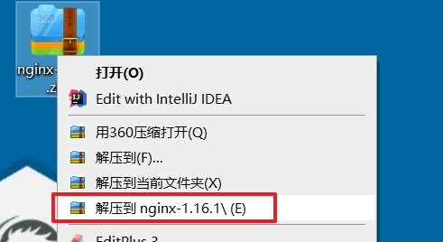
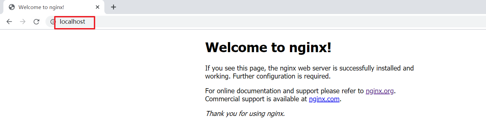
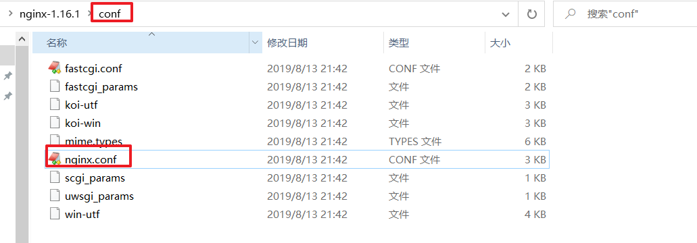
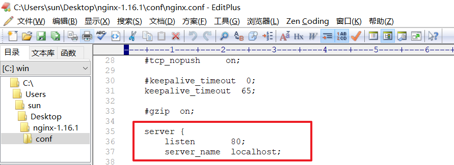
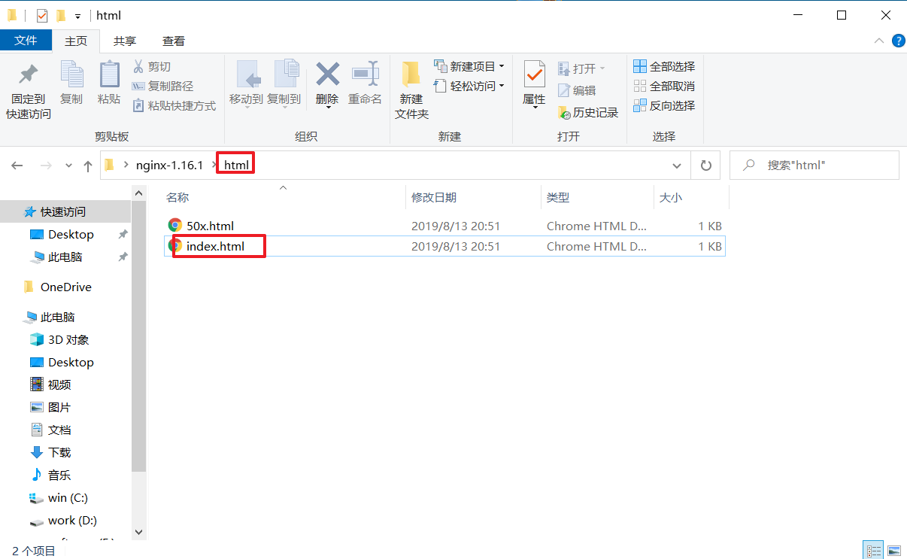
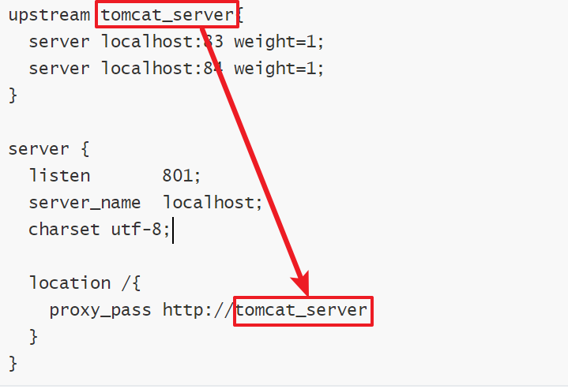

#### 1、了解nginx

> Nginx是一个http服务器。是一个使用c语言开发的**高性能**的http服务器及反向代理服务器。Nginx是一款高性能的http 服务器/反向代理服务器及电子邮件( IMAP/POP3) 代理服务器。由俄罗斯的程序设计师Igor Sysoev所开发，官方测试nginx能够支支撑5万并发链接，并且cpu、内存等资源消耗却非常低，运行非常稳定。

nginx和tomcat

>   nginx常用做静态内容服务和反向代理服务器，直面外来请求转发给后面的应用服务（tomcat等等服务器），tomcat更多用来做做一个应用容器，让java web app跑在里面。
>
>   但是事无绝对，tomcat也可以直接提供http服务，通常用在内网和不需要流控等小型服务的场景  

nginx 的特点

> 反向代理: 客户端对代理是无感知的，因为客户端不需要任何配置就可以访问，我们只需要将请求发送到反向代理服务器，由反向代理服务器去选择目标服务器获取数据后，在返回给客户端，此时反向代理服务器和目标服务器对外就是一个服务器，暴露的是代理服务器地址，隐藏了真实服务器IP地址。

> 负载均衡：当同时有多个用户访问我们的服务器的时候，为了减少服务器的压力，我们需要将用户引入
> 服务器集群中的较轻压力的服务器，分担较重压力服务器的负担。

#### 2、nginx的安装和启动

##### 1、下载地址

​		http://nginx.org/

​		**资料中已经准备好，可直接使用**

##### 2、安装

1、解压

	

2、在cmd切换到nginx所在目录，输入命令 start nginx 

	

3、在地址栏访问（默认为80端口号）



##### 3、配置详解

**conf 目录为配置文件**



**nginx.conf 中可以修改端口号(默认为80)**



**如果修改配置或新增资源，需用重新加载nginx**

​	nginx -s reload

**html目录中可以添加静态资源和页面，重新加载后，可以通过浏览器访问**



#### 3、nginx运行前端项目

##### 1、获取资源

把dist  目录下的 静态资源全部复制到nginx的html目录下 

执行nginx -s reload  重新加载

##### 2、 测试访问

访问http://localhost:80 ，如图所示


#### 4、反向代理【了解】

> 前端项目继续使用tomcat部署启动。使用nginx反向代理进行访问。优点是暴露的是代理服务器地址，隐藏了真实服务器IP地址，服务器更安全。

##### 1、反向代理入门

> 修改nginx 的conf目录中的nginx.conf 文件， 在http中添加如下内容

```json
server {
	listen       801; # 监听的端口号
	server_name  localhost;  #监听的主机
	charset utf-8;  #编码utf-8
 
	location /{
		proxy_pass http://localhost:83;   #代理的服务ip地址和端口号
	}
}
```

##### 2、负载均衡的配置

```json
# 负载均衡，配置tomcat服务,指定多个tocmat服务地址或者端口号
# weight 权重值越高，选中几率越大
upstream tomcat_server{
	server localhost:83 weight=1;
	server localhost:84 weight=1;
}

server {
	listen       801;
	server_name  localhost;
	charset utf-8;
 
	location /{
		proxy_pass http://tomcat_server;
	}
}
```

> 代码的服务器是tomcat_server , tomcat_server 中配置多个地址或者端口号

